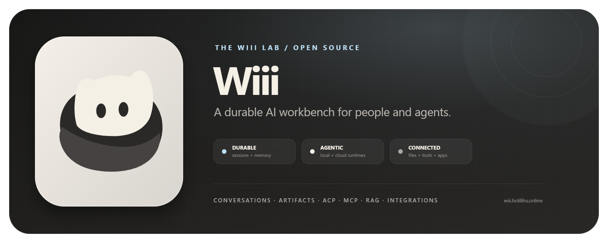

# Wiii

<p align="center">
  
</p>

<p align="center">
  <a href="https://github.com/meiiie/wiii/actions/workflows/test-backend.yml"></a>
  <a href="https://github.com/meiiie/wiii/actions/workflows/test-desktop.yml"></a>
  <a href="LICENSE"></a>
</p>

Wiii is an open-source AI workbench for durable conversations, local and cloud
agents, project files, tools, memory, artifacts, and permission-aware
integrations. It is built by **The Wiii Lab** and designed to stay useful across
different models, runtimes, knowledge domains, and host applications.

Vietnamese is the primary product language today. The architecture itself is
provider- and domain-extensible.

## What Wiii brings together

- **Durable work** — conversations, provider sessions, files, artifacts, and
  recovery state survive process replacement and app restarts.
- **Local + cloud agents** — use Wiii Cloud or run ACP-compatible local agents
  through the no-account **Neko Chill** workspace.
- **Files + live artifacts** — inspect project files, follow edits, and open
  code, Markdown, HTML previews, diagrams, and generated visual work beside the
  conversation.
- **Permission-aware tools** — tool calls and host mutations remain visible,
  reviewable, and gated before side effects.
- **Connected context** — RAG, semantic memory, MCP, embeds, documents, browser
  surfaces, and external applications meet behind explicit contracts.
- **Organization controls** — authentication, tenant context, feature policy,
  audit paths, and deployment controls support managed environments.

LMS support remains an important Wiii Connect adapter. It is one integration,
not the product boundary.

## Product map

| Layer | Responsibility |
| --- | --- |
| **Wiii Core** | API, orchestration, streaming, providers, tools, and retrieval |
| **Wiii Living** | continuity, memory, identity, goals, and long-running agent state |
| **Wiii Host** | desktop, embed, browser, LMS, and future host applications |
| **Wiii Connect** | ACP, MCP, documents, OAuth apps, and capability contracts |
| **Wiii Org** | identity, tenancy, policy, admin, and audit controls |
| **Wiii Data** | PostgreSQL/pgvector, optional graph context, caches, and object storage |

The repository contains two primary runtime surfaces:

- [`maritime-ai-service/`](maritime-ai-service/) — FastAPI backend,
  orchestration, RAG, memory, integrations, deployment assets, and tests.
- [`wiii-desktop/`](wiii-desktop/) — Tauri v2 desktop workbench, React client,
  Neko Chill, artifact workspace, and embed surfaces.

Shared architecture, governance, research, and brand sources live in
[`docs/`](docs/).

## Quick start

### Desktop workbench

Prerequisites: Node.js 18+, Rust, and the
[Tauri v2 prerequisites](https://v2.tauri.app/start/prerequisites/).

```bash
cd wiii-desktop
npm install
npm run tauri -- dev
```

For frontend-only iteration:

```bash
cd wiii-desktop
npm run dev
```

### Backend

```bash
cd maritime-ai-service
python -m venv .venv
# Windows: .venv\Scripts\activate
# macOS/Linux: source .venv/bin/activate
pip install -r requirements.txt
cp .env.example .env
docker compose up -d postgres neo4j minio valkey
alembic upgrade head
uvicorn app.main:app --reload
```

Use `copy .env.example .env` instead of `cp` in Command Prompt. Configure only
your own development secrets; never commit `.env` files.

## Build and verify

```bash
# Desktop
cd wiii-desktop
npx vitest run
npx tsc --noEmit
npm run build:embed
npm run tauri -- build --bundles nsis

# Backend
cd ../maritime-ai-service
pytest tests/unit/ -p no:capture --tb=short -q
ruff check app/ --select=E9,F63,F7
```

Windows installers are generated under
`wiii-desktop/src-tauri/target/release/bundle/nsis/`. Generated `dist*`, target,
coverage, and local screenshot output must stay out of source control.

## Documentation

- [Project mental model](docs/WIII_PROJECT_MENTAL_MODEL.md)
- [Codebase map](docs/architecture/WIII_CODEBASE_MAP.md)
- [Workbench identity and durable ACP boundary](docs/architecture/WIII_WORKBENCH_IDENTITY_AND_ACP.md)
- [Wiii Connect architecture](docs/architecture/wiii-connect/README.md)
- [Desktop engineering guide](wiii-desktop/README.md)
- [Backend engineering guide](maritime-ai-service/README.md)
- [Release standard](docs/releases/WIII_RELEASE_STANDARD.md)
- [Neko brand system](docs/assets/brand/neko-family-v1/README.md)

Wiii is active product and research engineering. Contracts that affect
persistence, permissions, integrations, or user data should be treated as
versioned interfaces, not informal implementation details.

## Contributing and security

Read [`AGENTS.md`](AGENTS.md), the issue templates, and
[`docs/operations/WIII_GITHUB_GOVERNANCE.md`](docs/operations/WIII_GITHUB_GOVERNANCE.md)
before broad changes. Open a focused issue, document risk and rollback for
high-impact paths, and include visual evidence for user-facing work.

Please report security-sensitive issues privately to the maintainers rather
than publishing credentials, private data, or exploit details in a public
issue.

## License

Wiii is available under the [MIT License](LICENSE).
