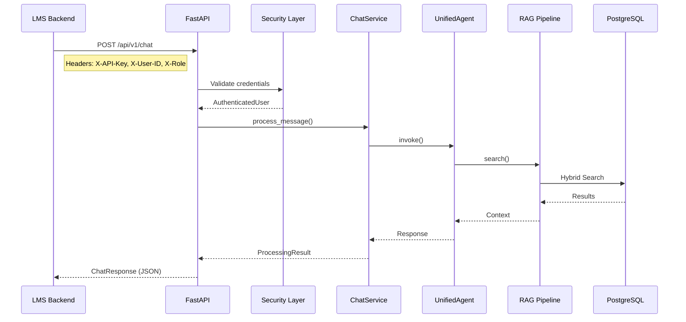
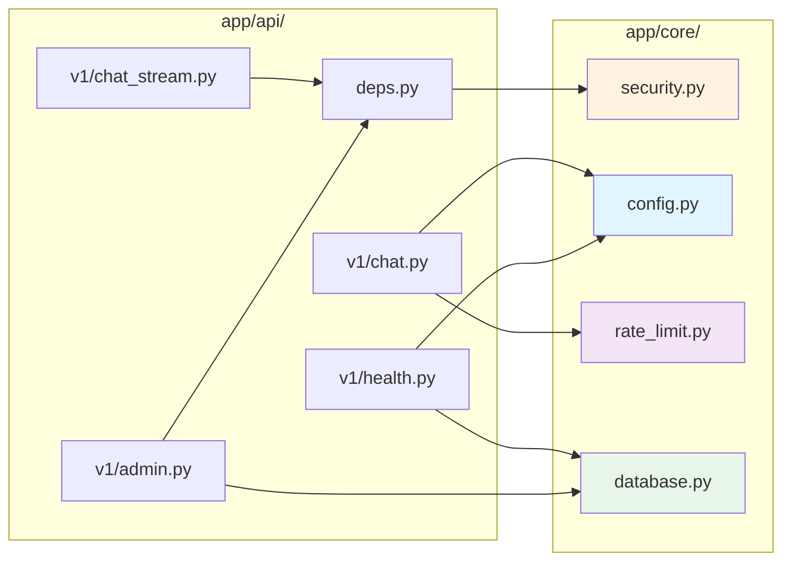

# API Layer - Maritime AI Service

> REST API endpoints for LMS integration and chat functionality.

**Last Updated:** 2025-12-21  
**Version:** 1.1.0 (P3 SOTA Streaming)

---

## 📁 Folder Structure

```
app/api/
├── __init__.py         # Router aggregation
├── deps.py             # Authentication dependencies
└── v1/
    ├── __init__.py     # v1 router (APIRouter)
    ├── chat.py         # Main chat endpoint
    ├── chat_stream.py  # SSE streaming
    ├── health.py       # Health checks
    ├── admin.py        # Document management
    ├── knowledge.py    # Ingestion API
    ├── memories.py     # User facts CRUD
    ├── sources.py      # Source details
    └── insights.py     # User insights
```

---

## 🔄 Request Processing Flow



---

## 🔗 API Reference for LMS Team

### 1. Chat Endpoint (Primary)

```http
POST /api/v1/chat
Content-Type: application/json
X-API-Key: {api_key}
X-User-ID: {student_id}
X-Role: student|teacher|admin
X-Session-ID: {session_id}
```

**Request Body:**
```json
{
    "user_id": "student-123",
    "message": "Quy tắc 15 COLREG nói gì?",
    "role": "student",
    "session_id": "session-abc"
}
```

**Response:**
```json
{
    "status": "success",
    "data": {
        "answer": "Quy tắc 15 quy định về tình huống cắt hướng...",
        "sources": [
            {
                "title": "COLREG Rule 15",
                "content_snippet": "When two power-driven vessels...",
                "image_url": "https://...",
                "page_number": 45,
                "document_id": "colreg-2023"
            }
        ],
        "suggested_questions": [
            "Quy tắc 16 là gì?",
            "Thế nào là tàu nhường đường?"
        ]
    },
    "metadata": {
        "processing_time": 1.234,
        "agent_type": "rag",
        "confidence_score": 0.85,
        "query_type": "factual"
    }
}
```

---

### 2. Streaming Endpoint (Real-time UX)

```http
POST /api/v1/chat/stream
Content-Type: application/json
X-API-Key: {api_key}
X-User-ID: {student_id}
X-Role: student
```

**Response:** Server-Sent Events (SSE)

```
event: thinking
data: {"content": "Đang phân tích câu hỏi..."}

event: answer
data: {"content": "Quy tắc 15 "}

event: answer
data: {"content": "quy định về tình huống "}

event: sources
data: {"sources": [...]}

event: suggested_questions
data: {"questions": ["...", "..."]}

event: metadata
data: {"processing_time": 1.234, ...}

event: done
data: {"status": "complete"}
```

### 2.1 ⚡ SOTA Streaming v2 (P3 - Dec 2025)

```http
POST /api/v1/chat/stream/v2
Content-Type: application/json
X-API-Key: {api_key}
```

**Key Difference:** True token-by-token streaming (first token ~20s vs ~60s)

```
event: thinking
data: {"content": "🎯 Đang phân tích câu hỏi..."}

event: thinking
data: {"content": "🔍 Đang tra cứu cơ sở dữ liệu..."}

event: thinking
data: {"content": "📚 Tìm thấy 10 tài liệu liên quan"}

event: answer                  <-- First token at ~20s (not ~60s)
data: {"content": "Theo "}

event: answer
data: {"content": "Điều 15..."}

event: sources
data: {"sources": [...]}

event: done
data: {"status": "complete"}
```

---

### 3. Health Check

```http
GET /api/v1/health          # Shallow (no DB)
GET /api/v1/health/deep     # Full check
GET /api/v1/health/live     # K8s liveness
GET /api/v1/health/ready    # K8s readiness
```

**Shallow Response:**
```json
{
    "status": "healthy",
    "components": {
        "api": {"status": "HEALTHY"}
    }
}
```

---

### 4. Chat History

```http
GET /api/v1/chat/history/{user_id}?limit=20&offset=0
X-API-Key: {api_key}
```

```http
DELETE /api/v1/chat/history/{user_id}
X-API-Key: {api_key}
X-Role: admin
```

---

### 5. User Memories (Facts)

```http
GET /api/v1/memories/{user_id}
X-API-Key: {api_key}
```

```http
DELETE /api/v1/memories/{user_id}/{memory_id}
X-API-Key: {api_key}
X-Role: admin
```

---

### 6. User Insights

```http
GET /api/v1/insights/{user_id}?category=learning_style
X-API-Key: {api_key}
```

---

### 7. Source Details (PDF Highlighting)

```http
GET /api/v1/sources/{node_id}
```

**Response includes bounding boxes for PDF highlighting:**
```json
{
    "node_id": "uuid",
    "content": "...",
    "page_number": 45,
    "document_id": "colreg-2023",
    "image_url": "https://...",
    "bounding_boxes": [
        {"x": 100, "y": 200, "width": 300, "height": 50}
    ]
}
```

---

## 🔐 Authentication

### Headers (Required)

| Header | Required | Description |
|--------|----------|-------------|
| `X-API-Key` | ✅ Yes | Server API key |
| `X-User-ID` | ✅ Yes | Student/User ID from LMS |
| `X-Role` | ⚠️ Recommended | `student` / `teacher` / `admin` |
| `X-Session-ID` | 🔘 Optional | Session tracking |
| `X-Organization-ID` | 🔘 Optional | Multi-tenant |

### Role-Based Access

| Role | Permissions |
|------|-------------|
| `student` | Chat, view history, view sources |
| `teacher` | + View all student data |
| `admin` | + Delete data, upload documents |

### Error Responses

```json
{
    "detail": "Authentication required. Provide X-API-Key header or Bearer token."
}
```

```json
{
    "detail": "Admin access required. Your role: student"
}
```

---

## 📊 Endpoint Summary

| Endpoint | Method | Auth | Admin | Description |
|----------|--------|------|-------|-------------|
| `/chat` | POST | ✅ | ❌ | Main chat |
| `/chat/stream` | POST | ✅ | ❌ | SSE streaming (v1) |
| `/chat/stream/v2` | POST | ✅ | ❌ | **SOTA token streaming** ⚡ |
| `/chat/status` | GET | ❌ | ❌ | Service status |
| `/chat/history/{id}` | GET | ✅ | ❌ | Get history |
| `/chat/history/{id}` | DELETE | ✅ | ✅ | Delete history |
| `/health` | GET | ❌ | ❌ | Shallow health |
| `/health/deep` | GET | ❌ | ❌ | Deep health |
| `/admin/documents` | POST | ✅ | ✅ | Upload PDF |
| `/admin/documents` | GET | ✅ | ❌ | List documents |
| `/admin/documents/{id}` | GET | ✅ | ❌ | Ingestion status |
| `/admin/documents/{id}` | DELETE | ✅ | ✅ | Delete document |
| `/knowledge/ingest` | POST | ✅ | ✅ | Multimodal ingest |
| `/knowledge/statistics` | GET | ❌ | ❌ | KB stats |
| `/memories/{id}` | GET | ✅ | ❌ | User facts |
| `/memories/{id}/{mid}` | DELETE | ✅ | ✅ | Delete fact |
| `/sources/{id}` | GET | ❌ | ❌ | Source details |
| `/sources` | GET | ❌ | ❌ | List sources |
| `/insights/{id}` | GET | ✅ | ❌ | User insights |

---

## 🛠️ LMS Integration Checklist

### Backend Team

- [ ] Store API key securely (environment variable)
- [ ] Pass `X-User-ID` with every request
- [ ] Pass `X-Role` based on user type
- [ ] Handle SSE events for streaming UI
- [ ] Implement retry logic (429 rate limit)

### Frontend Team

- [ ] Display sources with PDF links
- [ ] Show suggested questions
- [ ] Implement streaming text display
- [ ] Handle bounding boxes for PDF highlighting

## 🔗 Core Layer Dependencies

This folder depends on `app/core/` for:



### Import Dependencies

| This File | Uses from `app/core/` |
|-----------|----------------------|
| `deps.py` | `security.require_auth`, `security.AuthenticatedUser` |
| `v1/chat.py` | `config.settings`, `rate_limit.chat_rate_limit`, `rate_limit.limiter` |
| `v1/chat_stream.py` | via `deps.RequireAuth` → `security.require_auth` |
| `v1/health.py` | `config.settings`, `database.test_connection`, `database.get_shared_engine` |
| `v1/admin.py` | `database.get_shared_session_factory`, `deps.RequireAdmin` |
| `v1/knowledge.py` | `config.settings` |

---

## 📝 Related Documentation

- [Core Layer README](../core/README.md) - Config, Database, Security details
- [API Schema](../models/schemas.py) - Request/Response models
- [System Architecture](../../docs/architecture/SYSTEM_ARCHITECTURE.md)

---

## 📈 Metrics

| File | Lines | Endpoints |
|------|-------|-----------|
| `chat.py` | 500 | 4 |
| `health.py` | 433 | 4 |
| `sources.py` | 326 | 2 |
| `admin.py` | 290 | 4 |
| `knowledge.py` | 271 | 2 |
| `chat_stream.py` | 186 | 1 |
| `memories.py` | 159 | 2 |
| `insights.py` | 114 | 1 |
| `deps.py` | 80 | - |
| **Total** | **~2,400** | **20** |
