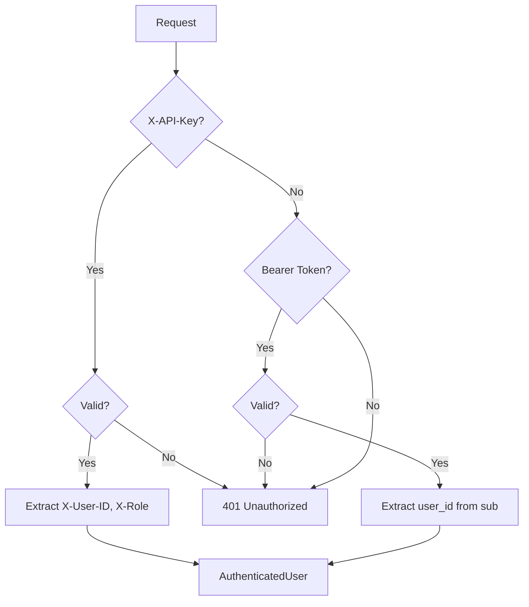
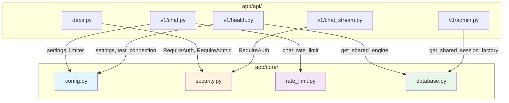

# Core Layer - Maritime AI Service

> Configuration, database, security, and rate limiting.

**Last Updated:** 2025-12-14

---

## 📁 Folder Structure

```
app/core/
├── __init__.py     # Exports
├── config.py       # Pydantic Settings (221 lines)
├── database.py     # Singleton DB engine (121 lines)
├── rate_limit.py   # Rate limiting (137 lines)
└── security.py     # Auth & JWT (250 lines)
```

---

## 🔧 Component Overview

### 1. Configuration (`config.py`)

**Pattern:** Pydantic Settings with environment validation

```python
from app.core.config import settings

# Access settings
settings.google_api_key
settings.database_url
settings.entity_extraction_enabled
```

**Configuration Groups:**

| Group | Settings | Environment Variables |
|-------|----------|----------------------|
| **Application** | app_name, debug, environment | `DEBUG`, `ENVIRONMENT` |
| **Database** | database_url, postgres_* | `DATABASE_URL` |
| **Neo4j** | neo4j_uri, neo4j_password | `NEO4J_URI`, `NEO4J_PASSWORD` |
| **LLM** | google_api_key, google_model | `GOOGLE_API_KEY` |
| **Embeddings** | embedding_model, embedding_dimensions | - |
| **Security** | api_key, jwt_secret_key | `API_KEY`, `JWT_SECRET_KEY` |
| **Rate Limit** | rate_limit_requests, chat_rate_limit | `RATE_LIMIT_REQUESTS` |
| **RAG** | contextual_rag_enabled, entity_extraction_enabled | - |
| **Chunking** | chunk_size, dpi_optimized | - |

**Key Feature Flags:**

```python
# Agent Selection
use_unified_agent: bool = True    # LLM-driven orchestration
use_multi_agent: bool = False     # Multi-agent system

# RAG Features
contextual_rag_enabled: bool = True   # Anthropic-style enrichment
entity_extraction_enabled: bool = True # GraphRAG entities
enable_corrective_rag: bool = True    # Self-correction

# Processing
hybrid_detection_enabled: bool = True  # Reduce Vision API calls
deep_reasoning_enabled: bool = True    # <thinking> tags
```

---

### 2. Database (`database.py`)

**Pattern:** Singleton with connection pooling

```python
from app.core.database import get_shared_engine, get_shared_session_factory

# Get singleton engine
engine = get_shared_engine()

# Get session factory
session_factory = get_shared_session_factory()
with session_factory() as session:
    result = session.execute(text("SELECT 1"))
```

**Pool Configuration:**

| Setting | Value | Purpose |
|---------|-------|---------|
| `pool_size` | 5 | Persistent connections |
| `max_overflow` | 5 | Extra under load (max: 10) |
| `pool_timeout` | 30s | Neon wake-up time |
| `pool_recycle` | 1800s | Refresh every 30 min |
| `pool_pre_ping` | True | Health check |

**Neon Serverless:**
- Uses pooled connection URL
- Handles SSL/sslmode conversion
- Auto wake-up support

---

### 3. Rate Limiting (`rate_limit.py`)

**Library:** slowapi (built on limits)

```python
from app.core.rate_limit import chat_rate_limit, limiter

@router.post("/chat")
@limiter.limit("30/minute")
async def chat_endpoint():
    pass
```

**Pre-defined Limits:**

| Limit | Rate | Use Case |
|-------|------|----------|
| `default_rate_limit` | 100/60s | General API |
| `chat_rate_limit` | 30/minute | Chat endpoints |
| `auth_rate_limit` | 5/minute | Auth endpoints |

**Client Identification:**
1. `X-API-Key` header (partial for privacy)
2. Fallback to IP address

**429 Response:**
```json
{
    "error": "rate_limited",
    "message": "Rate limit exceeded. Try again in 60 seconds.",
    "retry_after": 60
}
```

---

### 4. Security (`security.py`)

**Pattern:** Dual auth (API Key + JWT) with LMS headers

```python
from app.core.security import require_auth, AuthenticatedUser

@router.post("/endpoint")
async def endpoint(auth: AuthenticatedUser = Depends(require_auth)):
    print(auth.user_id)    # From X-User-ID or JWT
    print(auth.role)       # From X-Role
    print(auth.session_id) # From X-Session-ID
```

**Authentication Flow:**



**AuthenticatedUser Model:**

```python
class AuthenticatedUser:
    user_id: str           # From X-User-ID or JWT sub
    auth_method: str       # "api_key" or "jwt"
    role: str = "student"  # "student" | "teacher" | "admin"
    session_id: str | None # LMS session tracking
    organization_id: str | None  # Multi-tenant
```

**JWT Functions:**

```python
# Create token
token = create_access_token(subject="user-123", expires_delta=timedelta(hours=1))

# Verify token
payload = verify_jwt_token(token)
```

---

## 📊 Metrics

| File | Lines | Functions | Classes |
|------|-------|-----------|---------|
| `config.py` | 221 | 4 | 1 (Settings) |
| `database.py` | 121 | 4 | 0 |
| `rate_limit.py` | 137 | 4 | 0 |
| `security.py` | 250 | 7 | 2 |
| **Total** | **729** | **19** | **3** |

---

## ⚠️ Configuration Notes

### Required Environment Variables

```bash
# Database (Neon)
DATABASE_URL=postgresql://...

# LLM
GOOGLE_API_KEY=AIza...

# Security
API_KEY=your-api-key
JWT_SECRET_KEY=change-in-production

# Optional: Neo4j
NEO4J_URI=neo4j+s://...
NEO4J_PASSWORD=...
```

### Production Checklist

- [ ] Set `ENVIRONMENT=production`
- [ ] Set strong `JWT_SECRET_KEY`
- [ ] Set `API_KEY` (required for auth)
- [ ] Configure CORS origins
- [ ] Review rate limits

---

## 🔗 Dependency Relationships



### Import Map

| API File | Core Dependencies |
|----------|------------------|
| `deps.py` | `security.AuthenticatedUser`, `require_auth`, `optional_auth` |
| `v1/chat.py` | `config.settings`, `rate_limit.chat_rate_limit` |
| `v1/chat_stream.py` | `deps.RequireAuth` → `security.require_auth` |
| `v1/health.py` | `config.settings`, `database.test_connection` |
| `v1/admin.py` | `database.get_shared_session_factory`, `deps.RequireAdmin` |
| `v1/knowledge.py` | `config.settings` |

---

## 📝 Related Files

- [.env.example](../../.env.example) - Environment template
- [deps.py](../api/deps.py) - API dependencies using security
- [main.py](../main.py) - App initialization
