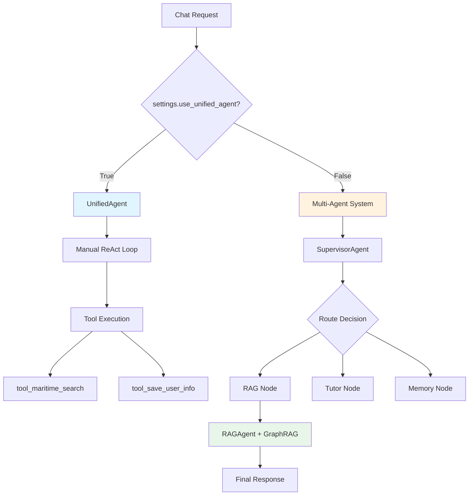

# Engine Layer - Maritime AI Service

> Core AI/ML components: Agents, RAG, Memory, and Multi-Agent System.

**Last Updated:** 2025-12-14

---

## 📁 Folder Structure

```
app/engine/                     # ~44 Python files
├── unified_agent.py            # Main ReAct agent (588 lines)
├── agentic_rag/               # Corrective RAG system
│   ├── rag_agent.py           # GraphRAG + Hybrid Search (811 lines)
│   ├── corrective_rag.py      # Self-correction loop
│   ├── retrieval_grader.py    # Relevance scoring
│   ├── answer_verifier.py     # Hallucination check
│   ├── query_analyzer.py      # Query classification
│   └── query_rewriter.py      # Query expansion
├── multi_agent/               # LangGraph Multi-Agent
│   ├── supervisor.py          # Query routing
│   ├── graph.py               # LangGraph workflow
│   ├── state.py               # Shared state
│   └── agents/                # Specialized agents
│       ├── rag_node.py
│       ├── tutor_node.py
│       ├── memory_agent.py
│       ├── grader_agent.py
│       └── kg_builder_agent.py  # ← Entity extraction moved here
├── tools/                     # LangChain Tools (11 tools)
│   ├── rag_tools.py           # Maritime search tool
│   ├── memory_tools.py        # User info tools
│   ├── tutor_tools.py         # Learning session tools
│   └── registry.py            # Tool registry
├── semantic_memory/           # Vector-based memory
│   ├── core.py                # Memory engine
│   ├── extraction.py          # Fact extraction
│   └── context.py             # Context builder
├── tutor/                     # Tutoring system (integrated via tools)
│   └── tutor_agent.py         # State machine tutoring
├── agents/                    # Agent base classes
│   ├── base.py                # BaseAgent
│   ├── config.py              # Agent configs
│   └── registry.py            # Agent registry
├── gemini_embedding.py        # Embedding service
├── rrf_reranker.py            # RRF reranking (22KB)
├── memory_manager.py          # Memory consolidation
├── context_enricher.py        # Contextual RAG
├── guardian_agent.py          # Safety guardrails
└── vision_extractor.py        # PDF Vision API
```

---

## 🔄 Request Flow (Agent Selection)



---

## 🧠 Core Components

### 1. UnifiedAgent (`unified_agent.py`)

**Pattern:** Manual ReAct (Reason + Act)

```python
from app.engine.unified_agent import get_unified_agent

agent = get_unified_agent()
response = await agent.process(
    message="Giải thích Rule 15",
    user_id="student-123",
    role="student"
)
```

**Features:**
- LLM-driven orchestration (CHỈ THỊ 13)
- Tool binding with `bind_tools()`
- Deep reasoning with `<thinking>` tags
- Dynamic persona via PromptLoader

**Tools Available:**
| Tool | Function | Description |
|------|----------|-------------|
| `tool_maritime_search` | RAG | Search maritime knowledge |
| `tool_save_user_info` | Memory | Save user facts |
| `tool_get_topic_details` | RAG | Get detailed topic info |
| `tool_search_cross_references` | RAG | Find related content |

---

### 2. RAGAgent (`agentic_rag/rag_agent.py`)

**Pattern:** GraphRAG (Hybrid Search + Entity Context)

```python
from app.engine.agentic_rag import get_rag_agent

rag = get_rag_agent()
response = await rag.query(
    question="Quy tắc 15 COLREGs",
    limit=5,
    user_role="student"
)
# response.answer, response.citations, response.entity_context
```

**Pipeline:**
1. **Query** → GraphRAG search (Hybrid + Neo4j entities)
2. **Context** → Entity enrichment from KG
3. **Synthesis** → LLM with role-based prompts
4. **Citations** → Bounding boxes for PDF highlighting

**CRAG Components:**
- `retrieval_grader.py` - Score relevance (0-10)
- `query_rewriter.py` - Expand/refine query
- `answer_verifier.py` - Check hallucination
- `corrective_rag.py` - Self-correction loop

---

### 3. Multi-Agent System (`multi_agent/`)

**Pattern:** LangGraph Supervisor

```python
from app.engine.multi_agent import build_multi_agent_graph

graph = build_multi_agent_graph()
result = await graph.ainvoke({
    "query": "Question here",
    "user_id": "student-123"
})
```

**Agent Types:**
| Agent | Purpose | Trigger |
|-------|---------|---------|
| `RAG` | Knowledge retrieval | Maritime keywords |
| `TUTOR` | Learning assistance | "giải thích", "quiz" |
| `MEMORY` | Personal context | "tên tôi", "lần trước" |
| `KG_BUILDER` | Entity extraction | Ingestion pipeline |
| `DIRECT` | Simple responses | Greetings |

**State Schema:**
```python
class AgentState(TypedDict):
    query: str
    user_id: str
    context: Dict[str, Any]
    next_agent: str
    agent_outputs: Dict[str, str]
    final_response: str
    # KG Builder outputs
    kg_builder_output: Optional[str]
    extracted_entities: List[Dict]
    extracted_relations: List[Dict]
```

---

### 4. Semantic Memory (`semantic_memory/`)

**Pattern:** Vector-based fact storage

```python
from app.engine.semantic_memory import get_semantic_memory

memory = get_semantic_memory()
facts = await memory.get_user_facts(user_id="student-123")
await memory.save_fact(user_id, key="name", value="Minh")
```

**Components:**
- `core.py` - Main SemanticMemory class
- `extraction.py` - LLM-based fact extraction
- `context.py` - Context building for prompts

---

### 5. Tools Registry (`tools/`)

**Pattern:** LangChain StructuredTool

```python
from app.engine.tools import get_all_tools, init_all_tools

# Initialize tools with dependencies
init_all_tools(rag_agent=rag, semantic_memory=memory)

# Get tools for agent binding
tools = get_all_tools()
llm_with_tools = llm.bind_tools(tools)
```

---

## 📊 File Metrics

| Component | Files | Total Lines | Key File |
|-----------|-------|-------------|----------|
| Root | 20 | ~3,500 | unified_agent.py (588) |
| agentic_rag | 7 | ~2,200 | rag_agent.py (811) |
| multi_agent | 8 | ~1,200 | supervisor.py (245) |
| semantic_memory | 4 | ~800 | core.py |
| tools | 4 | ~600 | rag_tools.py |
| tutor | 2 | ~400 | tutor_agent.py |
| agents | 4 | ~300 | base.py |
| **Total** | **~45** | **~9,000** | - |

---

## 🔗 Dependencies

### Uses from `app/core/`

| This Component | Uses |
|----------------|------|
| UnifiedAgent | `config.settings` |
| RAGAgent | `config.settings` |
| SupervisorAgent | `config.settings` |
| GeminiEmbedding | `config.google_api_key` |

### Uses from `app/services/`

| This Component | Uses |
|----------------|------|
| RAGAgent | `HybridSearchService`, `GraphRAGService` |
| MemoryTools | `SemanticMemory` |

### Uses from `app/repositories/`

| This Component | Uses |
|----------------|------|
| RAGAgent | `Neo4jKnowledgeRepository` |
| KGBuilderAgent | `Neo4jKnowledgeRepository` |

---

## ⚙️ Configuration Flags

```python
# app/core/config.py
use_unified_agent: bool = True      # vs Multi-Agent
use_multi_agent: bool = False       # LangGraph system
enable_corrective_rag: bool = True  # CRAG loop
deep_reasoning_enabled: bool = True # <thinking> tags
entity_extraction_enabled: bool = True  # GraphRAG entities
```

---

## 📝 Related Documentation

- [API Layer](../api/README.md) - Endpoints using engine
- [Services Layer](../services/README.md) - Business logic
- [Core Layer](../core/README.md) - Configuration
- [System Architecture](../../docs/architecture/SYSTEM_ARCHITECTURE.md)
