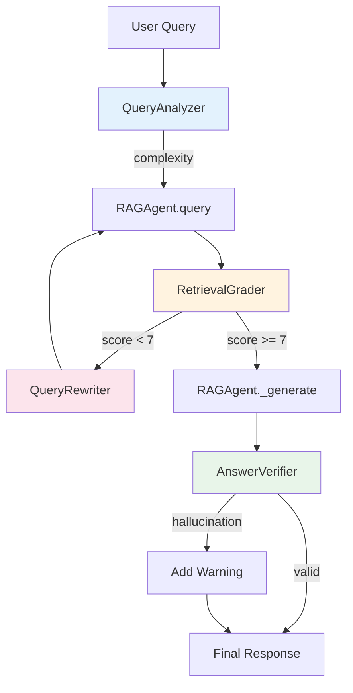

# Agentic RAG - Corrective RAG System

> Self-correcting RAG pipeline with query analysis, grading, and verification.

**Location:** `app/engine/agentic_rag/`  
**Pattern:** Corrective RAG (CRAG) - SOTA 2024

---

## 📁 Files

```
agentic_rag/
├── __init__.py           # Exports
├── rag_agent.py          # Main RAG agent (811 lines)
├── corrective_rag.py     # Orchestrator (367 lines)
├── query_analyzer.py     # Complexity classification (230 lines)
├── retrieval_grader.py   # Relevance scoring (296 lines)
├── query_rewriter.py     # Query improvement (232 lines)
└── answer_verifier.py    # Hallucination check (281 lines)
```

---

## 🔄 CRAG Pipeline



---

## 🧩 Components

### 1. RAGAgent (`rag_agent.py`)

**Main retrieval and generation engine.**

```python
from app.engine.agentic_rag import get_rag_agent

rag = get_rag_agent()
response = await rag.query(
    question="Quy tắc 15 là gì?",
    limit=5,
    user_role="student"
)
# RAGResponse(answer, citations, evidence_images, entity_context)
```

**Features:**
- GraphRAG integration (Hybrid + Entity Context)
- Evidence images collection
- Role-based prompts (student/teacher/admin)
- Bounding boxes for PDF highlighting

---

### 2. CorrectiveRAG (`corrective_rag.py`)

**Orchestrator with self-correction loop.**

**Pattern:** SOTA Composition Pattern (LangGraph CRAG 2024)

> CorrectiveRAG auto-composes internal RAGAgent instead of requiring DI injection.
> This follows LangGraph architecture where nodes are self-contained.

```python
from app.engine.agentic_rag import get_corrective_rag

# RAGAgent is auto-composed internally - no need to pass it
crag = get_corrective_rag()
result = await crag.process(query, context)

if result.was_rewritten:
    print(f"Query improved: {result.rewritten_query}")
if result.has_warning:
    print(f"Warning: low confidence")
```

**Architecture:**
```
┌─────────────────────────────────────────────────┐
│               CorrectiveRAG                     │
│  ┌───────────────────────────────────────────┐  │
│  │ Self-Composed Components:                 │  │
│  │ • RAGAgent (auto-init HybridSearch)       │  │
│  │ • QueryAnalyzer (LIGHT tier)              │  │
│  │ • RetrievalGrader (MODERATE tier)         │  │
│  │ • QueryRewriter (LIGHT tier)              │  │
│  │ • AnswerVerifier (LIGHT tier)             │  │
│  └───────────────────────────────────────────┘  │
└─────────────────────────────────────────────────┘
```

**Config:**
| Parameter | Default | Description |
|-----------|---------|-------------|
| `max_iterations` | 2 | Max rewrite attempts |
| `grade_threshold` | 7.0 | Min score to accept |
| `enable_verification` | True | Check hallucinations |

---

### 3. QueryAnalyzer (`query_analyzer.py`)

**Classifies query complexity.**

```python
from app.engine.agentic_rag import get_query_analyzer

analyzer = get_query_analyzer()
analysis = await analyzer.analyze("So sánh Rule 15 và 17")

# QueryAnalysis:
#   complexity: MODERATE
#   requires_verification: True
#   detected_topics: ["Regulations"]
```

**Complexity Levels:**
| Level | Example | Handling |
|-------|---------|----------|
| `SIMPLE` | "Rule 15 là gì?" | Direct lookup |
| `MODERATE` | "So sánh Rule 15 và 17" | Context needed |
| `COMPLEX` | "Tất cả quy tắc nhường đường" | Multi-step |

---

### 4. RetrievalGrader (`retrieval_grader.py`)

**Scores document relevance using SOTA batch grading.**

> **SOTA Pattern (2025):** Batch grading reduces 5 LLM calls → 1 call.
> Follows Anthropic Message Batches API and LangChain llm.batch patterns.

```python
from app.engine.agentic_rag import get_retrieval_grader

grader = get_retrieval_grader()
# Uses batch_grade_documents internally (SOTA)
result = await grader.grade_documents(query, documents)

if result.needs_rewrite:
    # avg_score < threshold
    print(f"Feedback: {result.feedback}")
```

**Batch Grading Architecture:**
```
Before (Sequential):     After (Batch - SOTA):
Doc1 → LLM → Grade1     ┌─────────────────────┐
Doc2 → LLM → Grade2     │ Doc1, Doc2, Doc3... │ → LLM → [Grades]
Doc3 → LLM → Grade3     └─────────────────────┘
5 calls × 8s = 40s       1 call × 10s = 10s (-75%)
```

**Output:**
```python
@dataclass
class GradingResult:
    query: str
    grades: List[DocumentGrade]  # Per-doc scores
    avg_score: float            # 0-10
    relevant_count: int
    feedback: str               # Why failed
```

---

### 5. QueryRewriter (`query_rewriter.py`)

**Improves underperforming queries.**

```python
from app.engine.agentic_rag import get_query_rewriter

rewriter = get_query_rewriter()
new_query = await rewriter.rewrite(query, feedback)
sub_queries = await rewriter.decompose(complex_query)
```

**Methods:**
| Method | Purpose |
|--------|---------|
| `rewrite(query, feedback)` | Improve based on feedback |
| `expand(query)` | Add synonyms |
| `decompose(query)` | Split complex queries |

---

### 6. AnswerVerifier (`answer_verifier.py`)

**Checks for hallucinations.**

```python
from app.engine.agentic_rag import get_answer_verifier

verifier = get_answer_verifier()
result = await verifier.verify(answer, sources)

if result.needs_warning():
    print(f"Issues: {result.issues}")
```

**Checks:**
- Factual consistency with sources
- Citation accuracy
- Made-up information

---

## 📊 Metrics

| File | Lines | Classes | Functions |
|------|-------|---------|-----------|
| `rag_agent.py` | 811 | 3 | 15+ |
| `corrective_rag.py` | 367 | 2 | 7 |
| `retrieval_grader.py` | 296 | 2 | 6 |
| `answer_verifier.py` | 281 | 1 | 5 |
| `query_rewriter.py` | 232 | 1 | 5 |
| `query_analyzer.py` | 230 | 2 | 4 |
| **Total** | **~2,200** | **11** | **42** |

---

## ⚙️ Configuration

From `app/core/config.py`:

```python
enable_corrective_rag: bool = True      # Enable CRAG loop
retrieval_grade_threshold: float = 7.0  # Min grade to accept
enable_answer_verification: bool = True # Check hallucinations
```

---

## 🔗 Dependencies

| Uses | From |
|------|------|
| `HybridSearchService` | `app/services/` |
| `GraphRAGService` | `app/services/` |
| `ReasoningTracer` | `app/engine/` |
| `settings` | `app/core/config.py` |

---

## 📋 Changelog

### 2025-12-16: CHỈ THỊ SỐ 29 v2 - SOTA Native-First Thinking

- **Simplified to Native-First Pattern**: Removed ThinkingGenerator
- **Pattern**: Gemini native thinking (zero extra latency) → Structured summary (fallback)
- **SOTA Alignment**: Claude Extended Thinking, Qwen QwQ, Gemini 2.5
- **Deleted**: `thinking_generator.py` (dead code)
- **Performance**: Reduced 2-3s latency by removing dual LLM call

### 2025-12-15: CHỈ THỊ SỐ 28 - SOTA Thinking Content

- **Added `thinking_content`** field to `CorrectiveRAGResult`
- Uses `ReasoningTracer.build_thinking_summary()` to generate prose
- SOTA Pattern: OpenAI o1 `reasoning.summary` / DeepSeek R1 `reasoning_content`
- Output: Human-readable markdown for LMS frontend "Thought Process" display

---

## 📝 Related

- [Parent: engine](../README.md)
- [GraphRAG Service](../../services/graph_rag_service.py)
- [Hybrid Search](../../services/hybrid_search_service.py)
