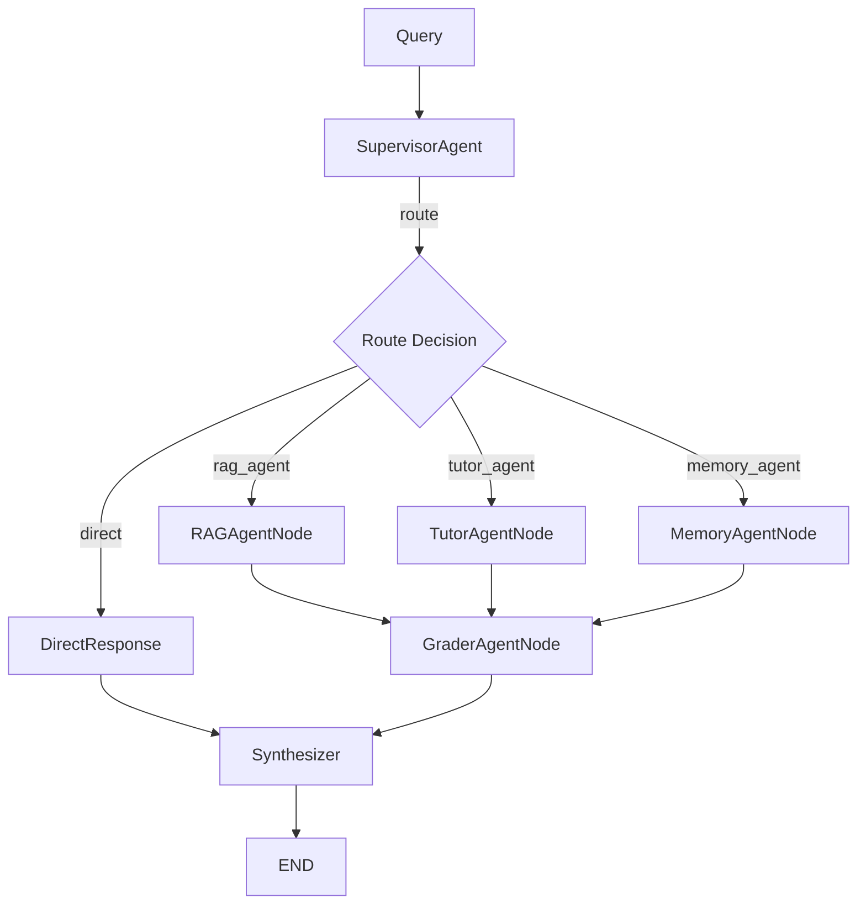

# Multi-Agent System - LangGraph Orchestration

> LangGraph-based multi-agent workflow with specialized worker agents.

**Location:** `app/engine/multi_agent/`  
**Pattern:** Supervisor + Worker Agents (LangGraph)  
**Status:** ✅ Fully integrated with `agents/` framework

---

## 🔗 agents/ Framework Integration

```python
# All agents now use AgentConfig and AgentTracer

# rag_node.py
from app.engine.agents import RAG_AGENT_CONFIG, AgentConfig

# graph.py - Tracing enabled
from app.engine.agents import get_agent_registry
with registry.tracer.span("rag_agent", "process"):
    result = await rag_agent.process(state)
```

---

## 📁 Files

```
multi_agent/
├── __init__.py         # Exports
├── state.py            # AgentState TypedDict (58 lines)
├── supervisor.py       # SupervisorAgent (250 lines) ✅ SUPERVISOR_AGENT_CONFIG
├── graph.py            # LangGraph workflow (275 lines) ✅ AgentTracer
└── agents/             # Worker agents
    ├── rag_node.py         # ✅ RAG_AGENT_CONFIG
    ├── tutor_node.py       # ✅ TUTOR_AGENT_CONFIG
    ├── memory_agent.py     # ✅ MEMORY_AGENT_CONFIG
    ├── grader_agent.py     # ✅ GRADER_AGENT_CONFIG
    └── kg_builder_agent.py # ✅ KG_BUILDER_AGENT_CONFIG
```

---

## 🔄 Workflow Graph



---

## 🔍 Tracing Output

```
[TRACE] supervisor.route [success] 45.2ms
[TRACE] rag_agent.process [success] 1234.5ms
[TRACE] grader_agent.process [success] 89.3ms
[MULTI_AGENT] Trace completed: 3 spans, 1369.0ms
```

Response includes `trace_id` and `trace_summary`.

---

## 📊 Metrics

| File | Lines |
|------|-------|
| `graph.py` | ~275 |
| `supervisor.py` | ~250 |
| `kg_builder_agent.py` | ~210 |
| `grader_agent.py` | ~210 |
| `tutor_node.py` | ~160 |
| `memory_agent.py` | ~150 |
| `rag_node.py` | ~100 |
| `state.py` | 58 |
| **Total** | **~1,400** |

---

## 📝 Related

- [agents/](../agents/README.md) - Provides AgentConfig, AgentTracer
- [agentic_rag/](../agentic_rag/README.md) - Used by rag_node
- [Parent: engine](../README.md)
