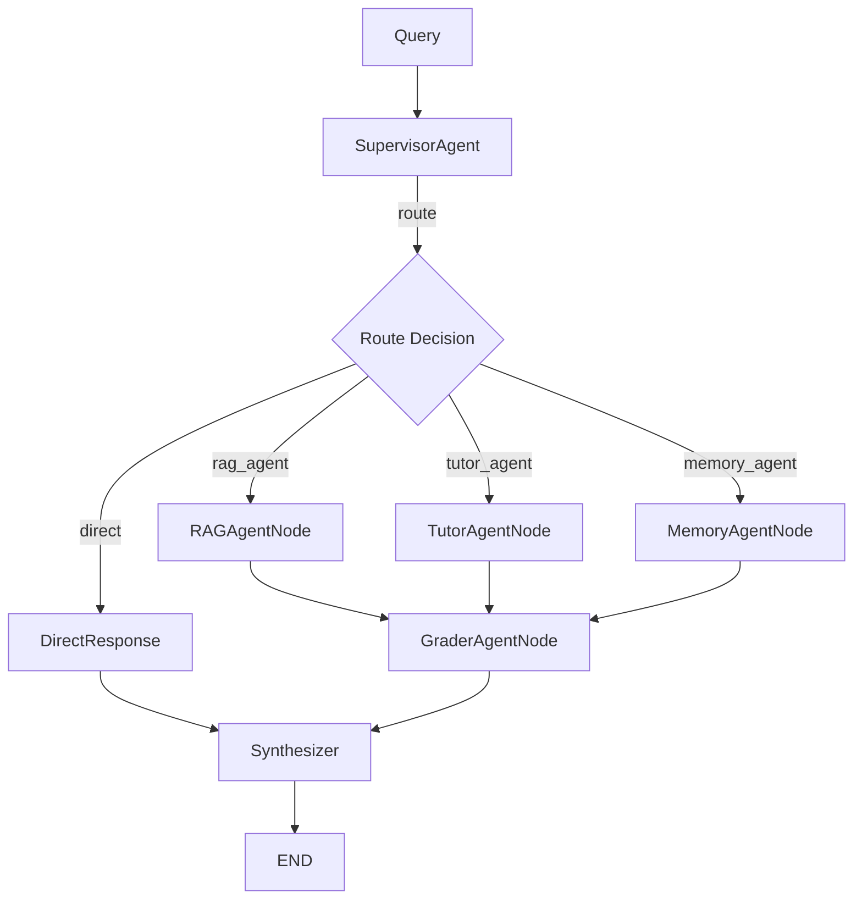

# Multi-Agent System - LangGraph Orchestration

> LangGraph-based multi-agent workflow with specialized worker agents.

**Location:** `app/engine/multi_agent/`  
**Pattern:** Supervisor + Worker Agents (LangGraph)  
**Status:** ✅ Fully integrated with `agents/` framework

---

## 🔗 agents/ Framework Integration

```python
# All agents now use AgentConfig and AgentTracer

# rag_node.py
from app.engine.agents import RAG_AGENT_CONFIG, AgentConfig

# graph.py - Tracing enabled
from app.engine.agents import get_agent_registry
with registry.tracer.span("rag_agent", "process"):
    result = await rag_agent.process(state)
```

---

## 📁 Files

```
multi_agent/
├── __init__.py         # Exports
├── state.py            # AgentState TypedDict (58 lines)
├── supervisor.py       # SupervisorAgent (250 lines) ✅ SUPERVISOR_AGENT_CONFIG
├── graph.py            # LangGraph workflow (275 lines) ✅ AgentTracer
└── agents/             # Worker agents
    ├── rag_node.py         # ✅ RAG_AGENT_CONFIG
    ├── tutor_node.py       # ✅ TUTOR_AGENT_CONFIG
    ├── memory_agent.py     # ✅ MEMORY_AGENT_CONFIG
    ├── grader_agent.py     # ✅ GRADER_AGENT_CONFIG
    └── kg_builder_agent.py # ✅ KG_BUILDER_AGENT_CONFIG
```

---

## 🔄 Workflow Graph



---

## 🔍 Tracing Output

```
[TRACE] supervisor.route [success] 45.2ms
[TRACE] rag_agent.process [success] 1234.5ms
[TRACE] grader_agent.process [success] 89.3ms
[MULTI_AGENT] Trace completed: 3 spans, 1369.0ms
```

Response includes `trace_id` and `trace_summary`.

---

## 📊 Metrics

| File | Lines |
|------|-------|
| `graph.py` | ~275 |
| `supervisor.py` | ~250 |
| `kg_builder_agent.py` | ~210 |
| `grader_agent.py` | ~210 |
| `tutor_node.py` | ~160 |
| `memory_agent.py` | ~150 |
| `rag_node.py` | ~100 |
| `state.py` | 58 |
| **Total** | **~1,400** |

---

## 📝 Changelog

### 2025-12-15: ReasoningTrace Integration (CHỈ THỊ SỐ 28)
- **Feature:** SOTA reasoning transparency - expose AI thinking process in API
- **Fixes:** 4 gaps in data flow (state.py, rag_node.py, graph.py, chat_orchestrator.py)
- **Result:** API now returns structured `reasoning_trace` with steps, durations, confidence

### 2025-12-15: Memory Agent Fix
- **Bug:** `MemoryAgentNode._semantic_memory` was `None` → returned "Không có thông tin về user"
- **Fix:** `graph.py:memory_node()` now injects `get_semantic_memory_engine()` singleton
- **Result:** Test 5 Thread Continuity passes (`remembers_name: true`)

---

## ⚡ SOTA 2025: TutorAgentNode ReAct Pattern

**Updated:** TutorAgentNode now implements SOTA ReAct pattern (Think→Act→Observe):

```python
# ReAct Loop with tool calling
llm_with_tools = self._llm.bind_tools([tool_maritime_search])

for iteration in range(max_iterations):
    response = await llm_with_tools.ainvoke(messages)
    if response.tool_calls:
        # ACT: Execute tools
        result = await tool_maritime_search.ainvoke(args)
        # OBSERVE: Add result to context
        messages.append(ToolMessage(content=result))
    else:
        break  # THINK: Generate final response
```

**Key Features:**
- ✅ Tool binding (tool_maritime_search → CorrectiveRAG)
- ✅ RAG-First system prompt (force retrieval before answering)
- ✅ Max 3 iterations per query
- ✅ tools_used tracking for API transparency

---

## 🚀 Future Enhancements (Phase 8+)

> Based on [Anthropic: Effective Context Engineering for AI Agents](https://www.anthropic.com/engineering/effective-context-engineering-for-ai-agents)

### 1. Self-Reflection (Self-RAG Style)
```python
# Add critique step after generation
critique = await llm.ainvoke([
    SystemMessage("Critique this answer for accuracy..."),
    HumanMessage(f"Answer: {response}\nSources: {sources}")
])
if critique.needs_revision:
    # Re-retrieve and regenerate
```
**Benefit:** Prevents hallucination in edge cases where LLM ignores RAG-first prompt.

### 2. Structured Outputs (Pydantic)
```python
from pydantic import BaseModel

class TutorDecision(BaseModel):
    needs_retrieval: bool
    query: str
    reasoning: str

# Force structured decision
llm_with_structure = llm.with_structured_output(TutorDecision)
```
**Benefit:** Guarantee tool calls, prevent prompt-ignoring behavior.

### 3. Sub-Agent Architecture
```
TutorAgent (coordinator)
├── KnowledgeRetriever (sub-agent, isolated context)
├── ExplanationGenerator (sub-agent)
└── VerificationAgent (sub-agent, checks accuracy)
```
**Benefit:** Clean context per task, parallel processing, better long-horizon performance.

### 4. Context Compaction
Summarize long conversations to prevent context rot. Already partially implemented via `ReasoningTracer`.

---

## 📝 Related

- [agents/](../agents/README.md) - Provides AgentConfig, AgentTracer
- [agentic_rag/](../agentic_rag/README.md) - Used by rag_node
- [Parent: engine](../README.md)
