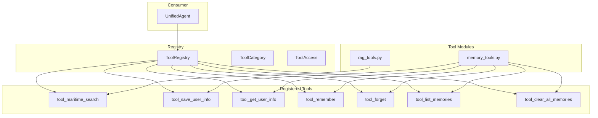

# Tools - LangChain Tool Registry

> Centralized tool management for AI agent capabilities.

**Location:** `app/engine/tools/`  
**Pattern:** Registry Pattern with Category-based Access Control

---

## 📁 Files (~770 lines total)

| File | Lines | Purpose |
|------|-------|---------|
| `registry.py` | 196 | ToolRegistry singleton, ToolCategory, ToolAccess |
| `rag_tools.py` | 123 | `tool_maritime_search` - knowledge retrieval |
| `memory_tools.py` | 455 | 6 memory tools (save/get/remember/forget/list/clear) |
| `__init__.py` | ~70 | Exports and `get_all_tools()` |

---

## 🏗️ Architecture



---

## 📋 Registered Tools (11 total)

### RAG Tools (1)

| Tool | Category | Access | Description |
|------|----------|--------|-------------|
| `tool_maritime_search` | RAG | READ | Search COLREGs, SOLAS, MARPOL via **CorrectiveRAG** (8-step trace) |

> **CHỈ THỊ SỐ 31 v3 (2025-12-19):** `tool_maritime_search` now uses `CorrectiveRAG.process()` instead of `RAGAgent.query()` to generate full 8-step reasoning trace for SOTA transparency.

### Memory Tools (6)

| Tool | Category | Access | Description |
|------|----------|--------|-------------|
| `tool_save_user_info` | MEMORY | WRITE | Save user name, job, background |
| `tool_get_user_info` | MEMORY | READ | Get saved user info |
| `tool_remember` | MEMORY_CONTROL | WRITE | Explicit "remember this" |
| `tool_forget` | MEMORY_CONTROL | WRITE | Explicit "forget this" |
| `tool_list_memories` | MEMORY_CONTROL | READ | List all memories |
| `tool_clear_all_memories` | MEMORY_CONTROL | WRITE | Factory reset |

### Tutor Tools (4) - **NEW: SOTA 2024**

| Tool | Category | Access | Description |
|------|----------|--------|-------------|
| `tool_start_lesson` | LEARNING | WRITE | Start structured lesson (SOLAS, COLREGs) |
| `tool_continue_lesson` | LEARNING | WRITE | Continue lesson or answer quiz |
| `tool_lesson_status` | LEARNING | READ | Get current session score |
| `tool_end_lesson` | LEARNING | WRITE | End lesson, show results |

**Teaching Flow via Tools:**
```
User: "Dạy tôi về SOLAS"
  → LLM calls tool_start_lesson("solas")
  → INTRODUCTION phase

User: "ready"  
  → LLM calls tool_continue_lesson("ready")
  → EXPLANATION phase

User: "ready"
  → LLM calls tool_continue_lesson("ready")
  → ASSESSMENT phase, asks Question

User: "Safety of Life at Sea"
  → LLM calls tool_continue_lesson("Safety of Life at Sea")
  → ✅ Correct! Score: 1/1 (100%)
```

---

## 🧩 Key Components

### 1. ToolRegistry (`registry.py`)

**Singleton managing all tools.**

```python
from app.engine.tools import get_tool_registry, ToolCategory

registry = get_tool_registry()

# Get all tools
all_tools = registry.get_all()

# Get by category
rag_tools = registry.get_by_category(ToolCategory.RAG)

# Get read-only safe tools
safe_tools = registry.get_read_only()

# Get summary
summary = registry.summary()
# {"total": 7, "categories": {"rag": 1, "memory": 2, "memory_control": 4}, ...}
```

### 2. ToolCategory (enum)

| Category | Purpose |
|----------|---------|
| `RAG` | Knowledge retrieval |
| `MEMORY` | User memory management |
| `MEMORY_CONTROL` | Explicit user control (Phase 10) |
| `LEARNING` | Future: Lesson, Quiz |
| `ASSESSMENT` | Future: Exam, Certificate |
| `SCHEDULE` | Future: Phase 12 |

### 3. ToolAccess (enum)

| Access | Safety | Description |
|--------|--------|-------------|
| `READ` | ✅ Safe | No state changes |
| `WRITE` | ⚠️ Mutating | Changes user data |

---

## 🔗 Relationships

### Used BY (Incoming)

| Consumer | Usage |
|----------|-------|
| `engine/unified_agent.py` | `get_all_tools()` for ReAct agent |

### Uses (Outgoing)

| File | Dependency |
|------|------------|
| `rag_tools.py` | `engine/agentic_rag/rag_agent.py` (runtime) |
| `memory_tools.py` | `engine/memory_manager.py` |
| `memory_tools.py` | `engine/semantic_memory/` |

---

## ⚙️ Initialization Flow

```python
# 1. Tools auto-register on import
import app.engine.tools.rag_tools     # Registers tool_maritime_search
import app.engine.tools.memory_tools  # Registers 6 memory tools

# 2. UnifiedAgent initializes runtime dependencies
from app.engine.tools import init_rag_tools, init_memory_tools
init_rag_tools(rag_agent)           # Set _rag_agent
init_memory_tools(semantic_memory)  # Set _semantic_memory
```

---

## 📊 Metrics

| Metric | Value |
|--------|-------|
| Total Lines | ~770 |
| Registered Tools | 7 |
| Categories Used | 3 (RAG, MEMORY, MEMORY_CONTROL) |
| Read-only Tools | 3 |
| Write Tools | 4 |

---

## ✅ Issues

**No critical issues!**

### Notes:
- Phase 10 explicit memory control fully implemented
- Auto-registration on import pattern
- Role-based access prepared for future use

---

## 📝 Related

- [UnifiedAgent](../unified_agent.py) - Consumes tools
- [Memory Manager](../memory_manager.py) - Used by memory tools
- [RAG Agent](../agentic_rag/rag_agent.py) - Used by rag tools
