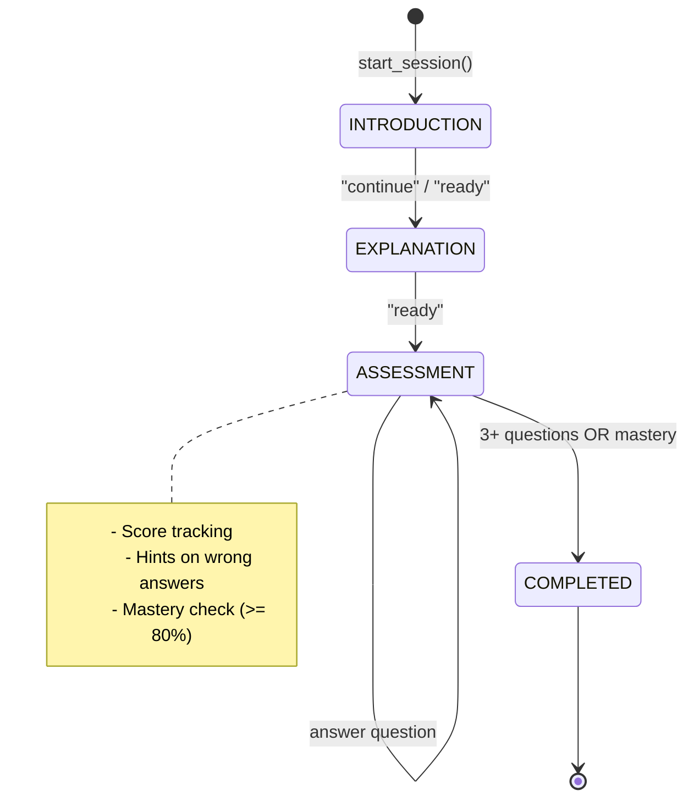

# Tutor - Structured Teaching Agent

> State-machine based tutoring with teaching phases and assessment.
> 
> **✅ INTEGRATED via `tutor_tools.py` (2025-12-14)**

**Location:** `app/engine/tutor/`  
**Pattern:** State Machine with Session Management  
**Access:** Via `tool_start_lesson`, `tool_continue_lesson` in UnifiedAgent

---

## 📁 Files (~400 lines)

| File | Lines | Purpose |
|------|-------|---------|
| `tutor_agent.py` | 402 | TutorAgent with TeachingPhase state machine |
| `__init__.py` | ~10 | Exports |

---

## 🏗️ Architecture



---

## 🧩 Key Components

### 1. TeachingPhase (enum)

| Phase | Description |
|-------|-------------|
| `INTRODUCTION` | Welcome, topic overview |
| `EXPLANATION` | Core content delivery |
| `ASSESSMENT` | Q&A with scoring |
| `COMPLETED` | Session finished |

### 2. TeachingState (Pydantic model)

```python
class TeachingState(BaseModel):
    session_id: str
    topic: str
    current_phase: TeachingPhase
    questions_asked: int = 0
    correct_answers: int = 0
    hints_given: int = 0
    current_question: Optional[str]
    awaiting_answer: bool = False
    
    @property
    def score(self) -> float:
        return (correct_answers / questions_asked) * 100
    
    def has_mastery(self) -> bool:
        return score >= 80.0 and questions_asked >= 3
```

### 3. TutorAgent

```python
from app.engine.tutor.tutor_agent import TutorAgent

tutor = TutorAgent()

# Start session
response = tutor.start_session("colregs", "user-123")
# → INTRODUCTION phase

# Continue
response = tutor.process_response("ready", session_id)
# → EXPLANATION phase

# Start assessment
response = tutor.process_response("ready", session_id)
# → ASSESSMENT phase, asks Question 1

# Answer questions
response = tutor.process_response("Collision Regulations", session_id)
# → Evaluates answer, asks Question 2
```

---

## 📚 Sample Content

### Topics with built-in questions:

| Topic | Questions |
|-------|-----------|
| `solas` | SOLAS full name, year adopted, purpose |
| `colregs` | COLREGs full name, rule count, port light color |
| `fire_safety` | SOLAS chapter, extinguisher requirements |

### Assessment Rules:
- Minimum 3 questions before completion
- Mastery: ≥ 80% score
- Struggling: < 50% after 3 questions
- Hints provided on wrong answers

---

## 🔗 Relationships

### Used BY (Incoming)

| Consumer | Usage |
|----------|-------|
| `services/chat_service.py` | TutorAgent for teaching mode |
| `multi_agent/agents/tutor_node.py` | (Different implementation) |

### Uses (Outgoing)

| Dependency | From |
|------------|------|
| `LearningProfile` | `models/learning_profile.py` |
| `Assessment` | `models/learning_profile.py` |

---

## ⚠️ Architecture Decision (2025-12-14)

### Two Tutor Implementations - **KEEP BOTH SEPARATE** ✅

| Location | Purpose | Pattern |
|----------|---------|---------|
| `engine/tutor/tutor_agent.py` | **Structured learning** with sessions, phases, assessment | State Machine |
| `multi_agent/agents/tutor_node.py` | **Quick explanations** via LLM | LangGraph Agentic |

**SOTA 2024-2025 Analysis:**
- Multi-agent pattern recommends specialized agents for specialized tasks
- Hybrid architecture: State Machine for assessment + LLM for content
- No merge needed - different use cases

**Use Case Routing:**
```
"Giải thích rule 15"     → multi_agent/tutor_node.py (quick LLM answer)
"Dạy tôi về SOLAS"       → tutor/tutor_agent.py (structured session)
"Quiz tôi về COLREGs"    → tutor/tutor_agent.py (assessment flow)
```

**Future Roadmap:**
1. ✅ Keep separate (now)
2. ⏳ Enhance both (LLM questions, session tracking)
3. ⏳ TutorOrchestrator when needed

---

## 📊 Metrics

| Metric | Value |
|--------|-------|
| Total Lines | ~400 |
| Classes | 5 (TeachingPhase, AnswerEvaluation, TeachingState, TutorResponse, TutorAgent) |
| Methods | 15+ |
| Sample Topics | 3 |

---

## ✅ Issues

**No critical issues!**

### Notes:
- Well-structured state machine
- Pydantic validation on TeachingState
- Assessment scoring with mastery tracking

---

## 📝 Related

- [Multi-Agent Tutor](../multi_agent/agents/tutor_node.py) - Different implementation
- [Chat Service](../../services/chat_service.py) - Consumer
- [Learning Profile](../../models/learning_profile.py) - Data model
