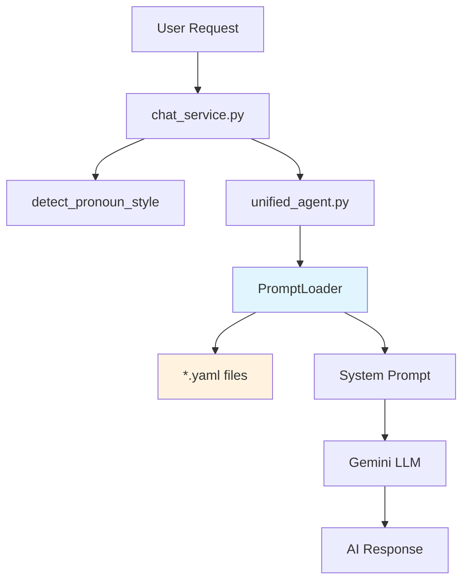

# Prompts - System Prompt Management

> YAML-based persona configuration with dynamic loading.

**Location:** `app/prompts/`  
**Pattern:** YAML Inheritance + Template Variables

---

## 📁 Structure

```
prompts/
├── __init__.py           # Exports
├── prompt_loader.py      # Main loader (775 lines)
├── agents/               # Agent personas
│   ├── assistant.yaml    # Teacher/Admin assistant
│   ├── memory.yaml       # Memory agent prompts
│   ├── rag.yaml          # RAG agent prompts
│   └── tutor.yaml        # Student tutor persona
└── base/
    └── _shared.yaml      # Shared base config (inheritance)
```

---

## 🎯 Vai trò trong hệ thống

**Prompts/ cung cấp "tính cách" cho AI** - quyết định cách AI giao tiếp với user.



---

## 🔄 Luồng Logic

### 1. Request đến
```
User: "Mình muốn hỏi về Rule 15"
```

### 2. Pronoun Detection (CHỈ THỊ SỐ 20)
```python
# chat_service.py
pronoun_style = detect_pronoun_style(message)
# → {"user_self": "mình", "user_called": "cậu", "ai_self": "mình"}
```

### 3. Build System Prompt
```python
# unified_agent.py
prompt = prompt_loader.build_system_prompt(
    role="student",           # → tutor.yaml
    user_name="Minh",         # → "Chào Minh"
    pronoun_style=pronoun_style  # → AI xưng "mình"
)
```

### 4. YAML Structure (tutor.yaml)
```yaml
agent:
  id: "tutor_agent"
  name: "Maritime Mentor"
  backstory: "Bạn là gia sư hàng hải thân thiện..."

style:
  tone: "Thân thiện, gần gũi như bạn bè"
  addressing:
    self: "mình"    # AI tự xưng
    
examples:
  - input: "Mình muốn học về COLREGs"
    output: "Tuyệt! Mình sẽ giúp cậu..."
```

### 5. Output
```
AI: "Hay quá Minh! Mình sẽ giúp cậu hiểu Rule 15 nhé..."
```

---

## 🔗 Quan hệ với các folder khác

| Folder | Relationship | How |
|--------|--------------|-----|
| `engine/unified_agent.py` | **Main consumer** | `build_system_prompt()` |
| `services/chat_service.py` | **Pronoun detection** | `detect_pronoun_style()` |
| `engine/semantic_memory/` | **User facts** | `{{user_name}}` replacement |
| `main.py` | **Pre-load** | Warm-up at startup |

### Import Map
```
┌─────────────────┐
│  chat_service   │──detect_pronoun_style()──┐
└─────────────────┘                          │
                                             ▼
┌─────────────────┐                   ┌─────────────────┐
│  unified_agent  │──build_prompt()──▶│  prompt_loader  │
└─────────────────┘                   └─────────────────┘
                                             │
                                             ▼
                                      ┌─────────────────┐
                                      │   YAML files    │
                                      │  (4 personas)   │
                                      └─────────────────┘
```

---

## 📊 Features (CHỈ THỊ KỸ THUẬT)

| Feature | CHỈ THỊ | Implementation |
|---------|---------|----------------|
| **Role-based prompts** | #16 | tutor.yaml vs assistant.yaml |
| **Pronoun adaptation** | #20 | detect_pronoun_style() |
| **Few-shot examples** | #16 | YAML `examples:` section |
| **Empathy detection** | #16 | Pattern matching |
| **Anti-repetition** | #16 | Variation phrases pool |
| **Template variables** | #16 | `{{user_name}}`, `{{honorific}}` |
| **Vietnamese Thinking** | #29 v8 | Direct `<thinking>` tags in `rag_agent.py` prompts |

> **Note (v8):** `build_thinking_instruction()` deprecated. Thinking now embedded in agent prompts.

---

## ⚠️ Audit Findings (2025-12-14)

| Check | Status |
|-------|--------|
| Dead code | ✅ None |
| All files used | ✅ 6/6 |
| SOTA compliance | ✅ YAML inheritance |
| Humanization | ✅ Few-shot examples |

---

## 📝 Related

- [Engine (unified_agent)](../engine/README.md)
- [Services (chat_service)](../services/README.md)
