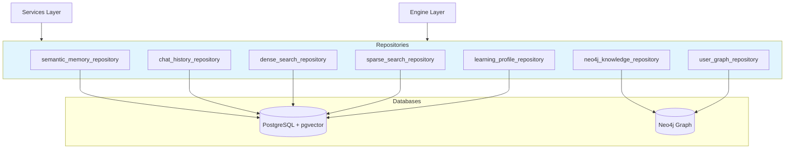

# Repositories - Data Access Layer

> Database and search index access using Repository Pattern.

**Location:** `app/repositories/`  
**Pattern:** Repository Pattern (SOTA)

---

## 📁 Files (8 total)

| File | Lines | Purpose | Used By |
|------|-------|---------|---------|
| `semantic_memory_repository.py` | ~1200 | pgvector memory | semantic_memory/, learning_graph |
| `neo4j_knowledge_repository.py` | ~900 | Neo4j KG access | rag_agent, graph_rag, ingestion |
| `chat_history_repository.py` | ~600 | Message history | chat.py, chat_service, main |
| `dense_search_repository.py` | ~500 | Vector search | hybrid_search_service |
| `learning_profile_repository.py` | ~400 | User profiles | chat_service |
| `user_graph_repository.py` | ~350 | User KG nodes | learning_graph, chat_service, admin |
| `sparse_search_repository.py` | ~300 | BM25 search | hybrid_search_service, health |

---

## 🎯 Vai trò trong hệ thống

**Repositories/ là lớp truy cập dữ liệu** - abstraction layer giữa business logic và databases.



---

## 🔗 Quan hệ với các folder

| Consumer | Repository | Purpose |
|----------|------------|---------|
| `semantic_memory/` | `semantic_memory_repository` | Store/retrieve facts |
| `agentic_rag/rag_agent` | `neo4j_knowledge_repository` | Entity context |
| `hybrid_search_service` | `dense_search + sparse_search` | Hybrid RAG |
| `chat_service` | `chat_history, learning_profile` | Context |
| `learning_graph_service` | `user_graph, semantic_memory` | Progress |

---

## 🧠 SOTA 2025: Role-Specific Knowledge Graphs

Theo nghiên cứu SOTA 2025, hệ thống sử dụng **role-specific knowledge graphs** riêng biệt:

| Role | Graph | Repository | Status |
|------|-------|------------|--------|
| **Student** | Learning Graph | `user_graph_repository` | ✅ Implemented |
| **Teacher** | Teaching Graph | `user_graph_repository` (future) | 🔜 Planned |
| **Admin** | System Graph | TBD | 🔜 Planned |

**Student Learning Graph:**
- `STUDIED`: User → Module (progress tracking)
- `COMPLETED`: User → Module (completion)
- `WEAK_AT`: User → Topic (knowledge gaps)
- `PREREQUISITE`: Module → Module (dependencies)

**Future Teacher Graph:**
```
Teacher → TEACHES → Module
Teacher → CREATED → Quiz
Teacher → ASSIGNED → Student
```

---

## 📝 Related

- [Models (schemas)](../models/README.md)
- [Services (consumers)](../services/README.md)
- [Engine (consumers)](../engine/README.md)
