# Maritime AI Service - Architecture Map

> Master architecture document following **C4 Model + arc42** best practices.

**Last Updated:** 2025-12-15  
**Status:** ✅ Complete  
**Version:** 2.1 (SOTA Multi-Agent Update)

---

## 📋 Table of Contents

1. [System Context](#1-system-context-c4-level-1)
2. [Container View](#2-container-view-c4-level-2)
3. [Component View](#3-component-view-c4-level-3)
4. [Folder Structure](#4-folder-structure)
5. [Request Flow](#5-request-flow)
6. [Cross-Cutting Concerns](#6-cross-cutting-concerns)
7. [Architecture Decisions](#7-architecture-decisions)
8. [Audit Summary](#8-audit-summary)

---

## 1. System Context (C4 Level 1)


**Actors:**
- **LMS Backend**: Sends chat requests, receives AI responses
- **Neo4j**: Knowledge Graph for maritime regulations
- **PostgreSQL**: Vector embeddings, user memory, chat history
- **Supabase**: PDF storage, image assets
- **Gemini**: LLM generation, embeddings

---

## 2. Container View (C4 Level 2)


---

## 3. Component View (C4 Level 3)

### Engine Layer Components


---

## 4. Folder Structure & Responsibilities

### 📂 Detailed Folder Functions

| Folder | Chức năng | Key Files | Exports |
|--------|-----------|-----------|---------|
| **`app/api/`** | HTTP endpoints, routing | `chat.py`, `admin.py`, `health.py` | FastAPI routers |
| **`app/core/`** | Config, security, DB connection | `config.py`, `security.py`, `database.py` | Settings, Auth |
| **`app/services/`** | Business logic (REFACTORED 2025-12-14) | `chat_service.py` (facade), `chat_orchestrator.py` (pipeline) | See Services below |
| **`app/engine/`** | AI/ML components, agents | `unified_agent.py`, tools/, agentic_rag/ | Agents, Tools |
| **`app/repositories/`** | Database access layer | `semantic_memory_repo.py`, `neo4j_repo.py` | CRUD operations |
| **`app/models/`** | Pydantic schemas, DTOs | `schemas.py` (623 lines), `semantic_memory.py` | Data models |
| **`app/prompts/`** | AI persona configuration | `prompt_loader.py`, agents/*.yaml | System prompts |

### 📂 Services Layer (REFACTORED 2025-12-14)

| File | Purpose | Lines | Pattern |
|------|---------|-------|--------|
| **`chat_service.py`** | Thin facade, wires dependencies | ~310 | Facade |
| **`chat_orchestrator.py`** | 6-stage pipeline orchestration | ~320 | Pipeline |
| **`session_manager.py`** | Session CRUD, anti-repetition state | ~230 | Singleton |
| **`input_processor.py`** | Validation, Guardian, context | ~380 | Processor |
| **`output_processor.py`** | Response formatting, sources | ~220 | Processor |
| **`background_tasks.py`** | Async task runner | ~260 | Task Runner |
| `chat_context_builder.py` | Context assembly | ~100 | Builder |
| `chat_response_builder.py` | Response assembly | ~100 | Builder |
| `hybrid_search_service.py` | Dense + Sparse search | ~400 | Service |
| `multimodal_ingestion_service.py` | PDF pipeline | ~600 | Service |
| `graph_rag_service.py` | GraphRAG with Neo4j | ~200 | Service |

### 📂 Engine Subfolders (app/engine/)

| Subfolder | Chức năng | Key Components |
|-----------|-----------|----------------|
| **`agentic_rag/`** | Corrective RAG system | `rag_agent.py`, `corrective_rag.py`, grader, verifier |
| **`multi_agent/`** | LangGraph SOTA 2025 orchestration | `supervisor.py`, `graph.py`, `tutor_node.py` (ReAct) |
| **`tools/`** | 11 LangChain tools | `rag_tools.py`, `memory_tools.py`, `tutor_tools.py` |
| **`semantic_memory/`** | Vector-based user memory | `core.py`, `extraction.py`, `context.py` |
| **`tutor/`** | State machine tutoring | `tutor_agent.py` |
| **`agents/`** | Agent base classes, registry | `base.py`, `config.py`, `registry.py` |

---

### 🔗 File-to-File Relationships

```
┌────────────────────────────────────────────────────────────────────────────────┐
│                           IMPORT DEPENDENCY MAP                                │
├────────────────────────────────────────────────────────────────────────────────┤
│                                                                                │
│  api/v1/chat.py ─────────────────────────────────────────────────────────────┐ │
│       │                                                                       │ │
│       ├─► core/security.py (require_auth)                                     │ │
│       ├─► core/config.py (settings)                                           │ │
│       └─► services/chat_service.py ──────────────────────────────────────────┤ │
│               │                                                               │ │
│               ├─► engine/unified_agent.py ───────────────────────────────────┤ │
│               │       │                                                       │ │
│               │       ├─► engine/tools/*.py (get_all_tools)                   │ │
│               │       │       ├─► rag_tools → agentic_rag/rag_agent.py        │ │
│               │       │       ├─► memory_tools → semantic_memory/core.py      │ │
│               │       │       └─► tutor_tools → tutor/tutor_agent.py          │ │
│               │       │                                                       │ │
│               │       └─► prompts/prompt_loader.py (build_system_prompt)      │ │
│               │               └─► prompts/agents/*.yaml                       │ │
│               │                                                               │ │
│               ├─► engine/semantic_memory/core.py ────────────────────────────┤ │
│               │       └─► repositories/semantic_memory_repository.py          │ │
│               │               └─► models/semantic_memory.py                   │ │
│               │                                                               │ │
│               └─► repositories/chat_history_repository.py                     │ │
│                       └─► models/database.py                                  │ │
│                                                                               │ │
└────────────────────────────────────────────────────────────────────────────────┘
```

### 🔗 Cross-Layer Dependencies

| From Layer | To Layer | Key Imports |
|------------|----------|-------------|
| `api/` → `core/` | security, config | `require_auth()`, `settings` |
| `api/` → `services/` | business logic | `ChatService`, `IngestionService` |
| `services/` → `engine/` | AI processing | `UnifiedAgent`, `SemanticMemory` |
| `services/` → `repositories/` | data access | `*Repository` classes |
| `engine/` → `repositories/` | storage | `SemanticMemoryRepository` |
| `engine/` → `prompts/` | persona | `PromptLoader` |
| `repositories/` → `models/` | schemas | Pydantic models |

### 🔗 Tools ↔ Components Mapping

| Tool | Component | Purpose |
|------|-----------|---------|
| `tool_maritime_search` | `RAGAgent` | Search maritime knowledge |
| `tool_get_topic_details` | `RAGAgent` | Get detailed explanations |
| `tool_search_cross_references` | `RAGAgent` | Find related content |
| `tool_search_images` | `RAGAgent` | Find relevant images |
| `tool_save_user_info` | `SemanticMemory` | Store user facts |
| `tool_get_user_info` | `SemanticMemory` | Retrieve user context |
| `tool_remember_preference` | `SemanticMemory` | Save preferences |
| `tool_start_lesson` | `TutorAgent` | Begin learning session |
| `tool_continue_lesson` | `TutorAgent` | Progress in lesson |
| `tool_lesson_status` | `TutorAgent` | Check session state |
| `tool_end_lesson` | `TutorAgent` | Complete session |

### Audit Status

| Layer | Folder | Files | README | Status |
|-------|--------|-------|--------|--------|
| API | `app/api/` | 8 | ✅ | Auth fixed |
| Core | `app/core/` | 6 | ✅ | Clean |
| Services | `app/services/` | 16 | ✅ | REFACTORED 2025-12-14 |
| Engine | `app/engine/` | 44 | ✅ | Dead code removed |
| Repos | `app/repositories/` | 8 | ✅ | Clean |
| Models | `app/models/` | 6 | ✅ | Clean |
| Prompts | `app/prompts/` | 6 | ✅ | Clean |

### Root Folders

| Folder | Purpose | Files | Key Contents |
|--------|---------|-------|--------------|
| `archive/` | Legacy/backup code | 10 | Old implementations |
| `scripts/` | Dev utilities | 50 | test_*.py, migrations |
| `tests/` | Automated tests | 4 dirs | unit/, integration/, e2e/ |
| `alembic/` | DB migrations | 6 | Schema evolution |
| `docs/` | Documentation | 4 dirs | architecture/, api/, schemas/ |

---

## 5. Request Flow

### Chat Request (Primary Flow)

```mermaid
sequenceDiagram
    participant LMS
    participant API as api/v1/chat.py
    participant Auth as core/security.py
    participant CS as ChatService
    participant UA as UnifiedAgent
    participant Tools as tools/
    participant HS as HybridSearchService
    participant SM as SemanticMemory
    participant DB as PostgreSQL
    
    LMS->>API: POST /api/v1/chat
    API->>Auth: require_auth()
    Auth-->>API: AuthenticatedUser
    
    API->>CS: process_message()
    CS->>SM: get_user_context()
    SM->>DB: pgvector similarity
    DB-->>SM: User facts
    
    CS->>UA: process(message, user_context)
    
    loop ReAct Loop (max 5)
        UA->>UA: Think → Decide Tool
        UA->>Tools: tool_maritime_search()
        Tools->>HS: search()
        HS->>DB: Hybrid (dense + sparse)
        DB-->>HS: Results
        HS-->>Tools: Citations
        Tools-->>UA: Tool Result
    end
    
    UA->>UA: Generate Final Response
    UA-->>CS: AgentResponse
    CS->>SM: extract_and_store_facts()
    CS-->>API: ChatResponse
    API-->>LMS: JSON Response
```



### PDF Ingestion Flow


### Memory Flow (Semantic Memory)

```mermaid
sequenceDiagram
    participant User
    participant CS as ChatService
    participant SM as SemanticMemory
    participant FE as FactExtractor
    participant DB as PostgreSQL
    
    Note over User,DB: User says: "Tôi là Minh, sinh viên năm 3"
    
    User->>CS: Message
    CS->>SM: extract_and_store_facts(message)
    SM->>FE: LLM extract facts
    FE-->>SM: [name=Minh, role=student, level=year3]
    
    loop For each fact
        SM->>DB: Check duplicates (embedding similarity)
        alt New fact
            SM->>DB: INSERT with embedding
        else Existing fact
            SM->>DB: UPDATE with higher confidence
        end
    end
    
    Note over User,DB: Next conversation...
    
    User->>CS: New message
    CS->>SM: get_user_context(user_id)
    SM->>DB: pgvector similarity search
    DB-->>SM: User facts
    SM-->>CS: "Minh là sinh viên năm 3"
```



### Tutor Flow (Learning Sessions)


### CRAG Flow (Corrective RAG)


### Pronoun Adaptation Flow

```mermaid
graph LR
    Msg[User: "Mình muốn hỏi..."] --> Detect[detect_pronoun_style]
    Detect --> Style[ai_self=mình<br/>user_called=cậu]
    Style --> Prompt[build_system_prompt]
    Prompt --> LLM[Gemini]
    LLM --> Resp["AI: Hay quá! Mình sẽ giúp cậu..."]
```

### Complete System Integration

```mermaid
graph TB
    subgraph "Frontend (LMS)"
        UI[Chat Interface]
    end
    
    subgraph "API Layer"
        Chat[/api/v1/chat]
        Stream[/api/v1/chat/stream]
        Admin[/api/v1/admin]
    end
    
    subgraph "Services Layer"
        CS[ChatService]
        HS[HybridSearchService]
        GS[GraphRAGService]
        IS[IngestionService]
    end
    
    subgraph "Engine Layer"
        UA[UnifiedAgent]
        
        subgraph "Tools (11)"
            RAG[rag_tools<br/>4 tools]
            MEM[memory_tools<br/>3 tools]
            TUT[tutor_tools<br/>4 tools]
        end
        
        subgraph "Core Components"
            CRAG[CorrectiveRAG]
            SM[SemanticMemory]
            TA[TutorAgent]
            PL[PromptLoader]
        end
    end
    
    subgraph "Data Layer"
        PG[(PostgreSQL<br/>+ pgvector)]
        NEO[(Neo4j<br/>Knowledge Graph)]
        SB[(Supabase<br/>Storage)]
    end
    
    UI --> Chat
    UI --> Stream
    UI --> Admin
    
    Chat --> CS
    Stream --> CS
    Admin --> IS
    
    CS --> UA
    UA --> RAG & MEM & TUT
    UA --> PL
    
    RAG --> CRAG
    MEM --> SM
    TUT --> TA
    
    CRAG --> HS
    CRAG --> GS
    HS --> PG
    GS --> NEO
    SM --> PG
    IS --> SB
    IS --> PG
    IS --> NEO
    
    style UA fill:#E91E63,color:white
    style CRAG fill:#2196F3,color:white
    style SM fill:#4CAF50,color:white
```

---

## 6. Cross-Cutting Concerns

### Authentication

```
X-API-Key → core/security.py → AuthenticatedUser
    ├── user_id: from X-User-ID header
    ├── role: from X-User-Role header  
    └── session_id: from X-Session-ID header
```

### Configuration

```python
# app/core/config.py
use_unified_agent: bool = True      # ReAct agent (default)
use_multi_agent: bool = False       # LangGraph system
enable_corrective_rag: bool = True  # CRAG loop
deep_reasoning_enabled: bool = True # <thinking> tags
```

### Prompt Management

```
prompts/
├── base/_shared.yaml      # Inheritance base
├── agents/
│   ├── tutor.yaml        # Student persona
│   ├── assistant.yaml    # Teacher/Admin
│   ├── rag.yaml          # RAG agent
│   └── memory.yaml       # Memory agent
└── prompt_loader.py      # Dynamic loading
    ├── detect_pronoun_style()
    └── build_system_prompt()
```

---

## 7. Architecture Decisions

### ADR-001: ReAct vs Multi-Agent

| Decision | ReAct (UnifiedAgent) as default |
|----------|--------------------------------|
| **Context** | Need flexible agent orchestration |
| **Decision** | Use manual ReAct loop over LangGraph |
| **Rationale** | Simpler, more control, faster iteration |
| **Status** | ✅ Active |

### ADR-002: TutorAgent Integration

| Decision | TutorAgent as Tools |
|----------|---------------------|
| **Context** | Need structured learning sessions |
| **Decision** | Expose TutorAgent via tutor_tools.py |
| **Rationale** | SOTA tool pattern, state management |
| **Status** | ✅ Active |

### ADR-003: Hybrid Search

| Decision | Dense + Sparse with RRF |
|----------|------------------------|
| **Context** | Need accurate maritime retrieval |
| **Decision** | Combine pgvector + tsvector |
| **Rationale** | Best recall for technical docs |
| **Status** | ✅ Active |

---

## 8. Audit Summary (2025-12-14)

### Dead Code Removed

| File | Lines | Reason |
|------|-------|--------|
| `entity_extractor.py` | 358 | Duplicate of kg_builder_agent |
| TutorAgent init | ~5 | Now via tutor_tools |

### REFACTORED (2025-12-14)

| Item | Before | After |
|------|--------|-------|
| `chat_service.py` | 1263 lines | 310 lines (facade) |
| Services files | 11 | 16 (+5 new modules) |
| Pattern | Monolithic | Pipeline + Processors |

### Deprecated Fixed

| Method | Fix |
|--------|-----|
| `store_user_fact()` | Added warnings.warn() |

### Future Work

| Item | Status |
|------|--------|
| LMS Event Callbacks | 🟡 Awaiting LMS deploy |
| Multi-Agent Path | ⏸️ Disabled |

---

## 📚 Related Documents

- [SYSTEM_ARCHITECTURE.md](SYSTEM_ARCHITECTURE.md) - Detailed design
- [contextual-rag.md](contextual-rag.md) - RAG patterns
- [tool-registry.md](tool-registry.md) - Tool management
