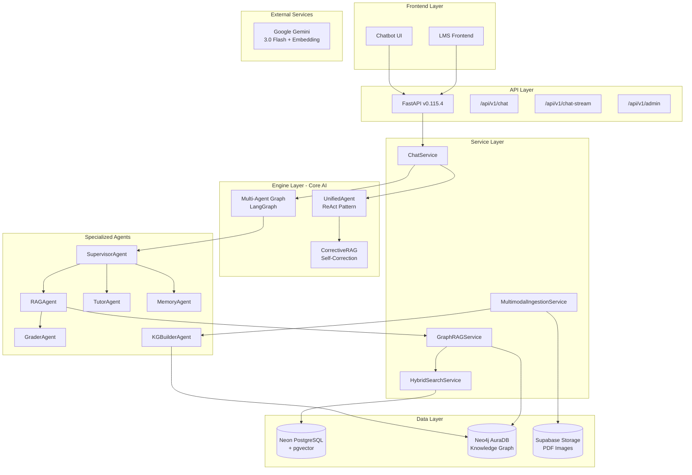
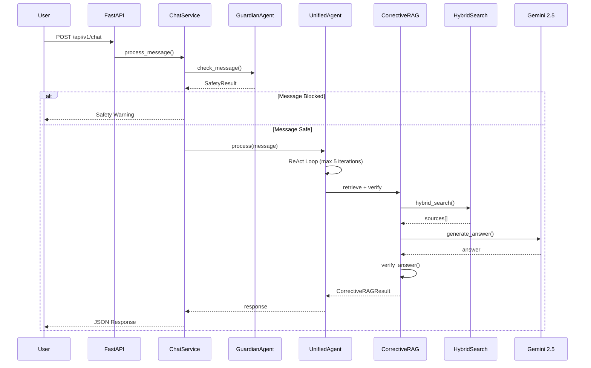
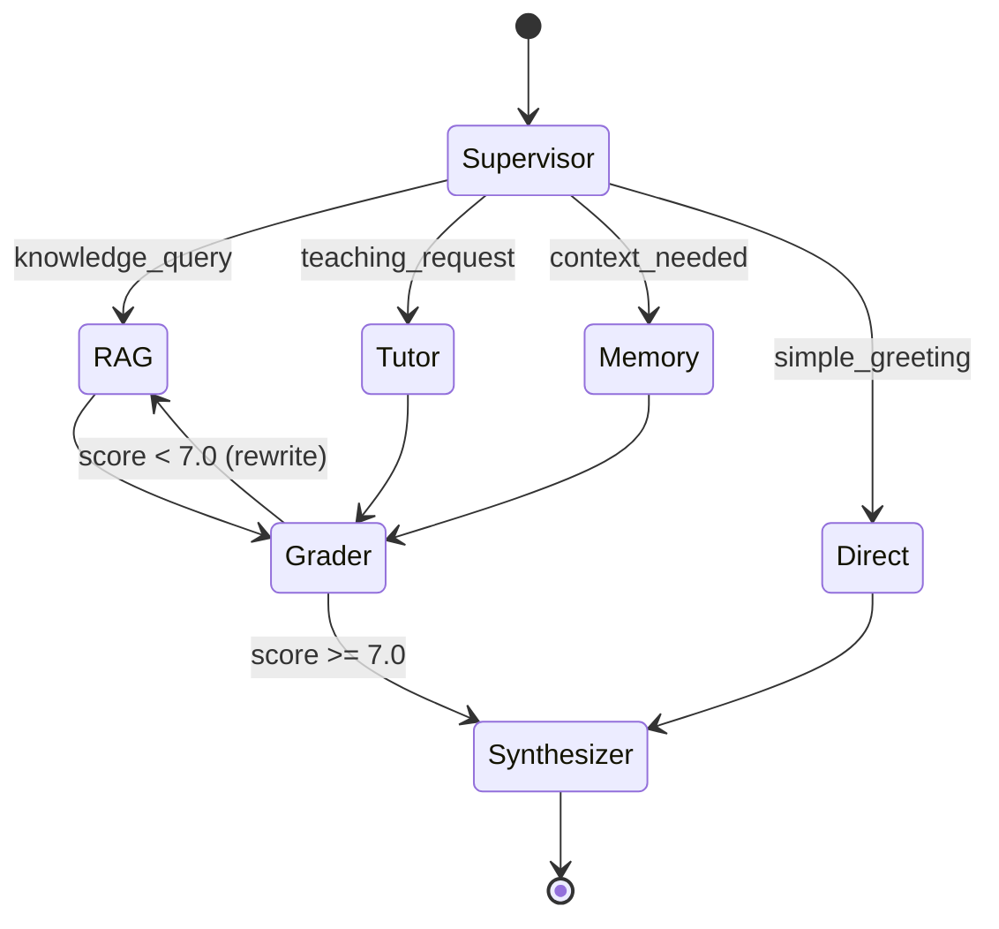
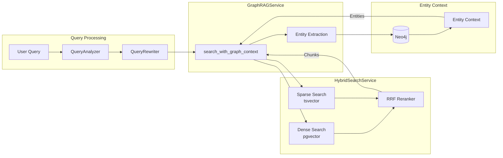
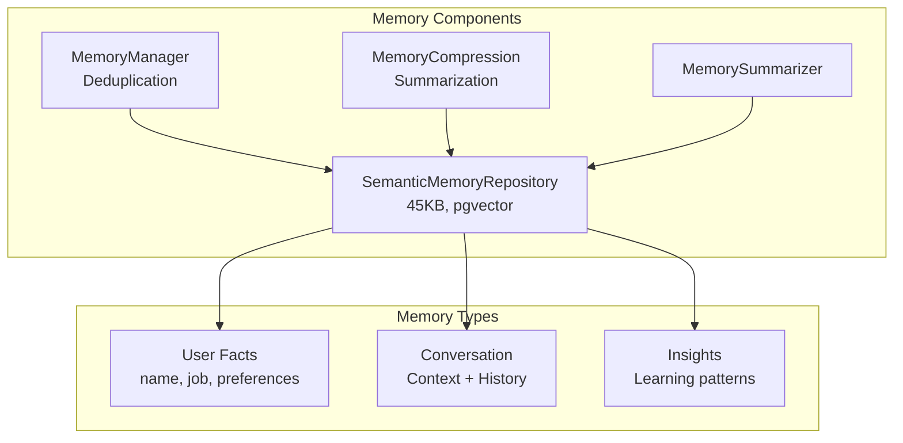
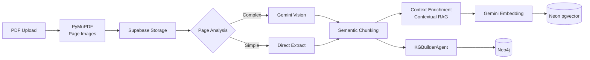
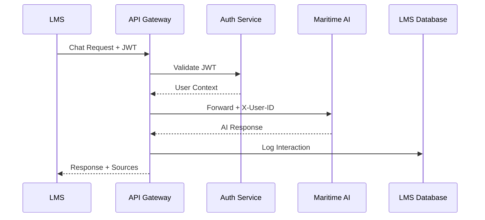

# Maritime AI Service - System Architecture

**Version:** 3.1 (2025-12-20)  
**Purpose:** LMS Integration Preparation  
**Status:** Production Ready - Phase 2.4a SOTA Optimizations Applied

---

## Table of Contents

1. [High-Level Architecture](#high-level-architecture)
2. [Project Structure](#project-structure)
3. [Core Components Deep Dive](#core-components-deep-dive)
4. [Data Flow Diagrams](#data-flow-diagrams)
5. [SOTA Comparison](#sota-comparison)
6. [Integration Points for LMS](#integration-points-for-lms)
7. [Improvement Recommendations](#improvement-recommendations)

---

## High-Level Architecture



---

## Project Structure

```
maritime-ai-service/
├── app/
│   ├── main.py                 # FastAPI app entry (9.5KB)
│   ├── api/v1/                 # REST endpoints
│   │   ├── chat.py             # Main chat endpoint (17KB)
│   │   ├── chat_stream.py      # SSE streaming (7KB)
│   │   ├── health.py           # Health checks (15KB)
│   │   ├── admin.py            # Admin operations
│   │   ├── knowledge.py        # Knowledge management
│   │   ├── memories.py         # Memory API
│   │   └── sources.py          # Source retrieval
│   │
│   ├── core/                   # Configuration
│   │   ├── config.py           # Settings (12KB, 220+ configs)
│   │   ├── database.py         # DB connection pooling
│   │   ├── security.py         # Auth/Security
│   │   └── rate_limit.py       # Rate limiting
│   │
│   ├── engine/                 # Core AI Logic
│   │   ├── unified_agent.py    # ReAct Agent (26KB)
│   │   ├── agentic_rag/        # Corrective RAG pipeline
│   │   ├── multi_agent/        # LangGraph multi-agent
│   │   ├── tools/              # LangChain tools
│   │   ├── memory_*.py         # Memory subsystem (5 files)
│   │   └── [10+ other engines]
│   │
│   ├── services/               # Business Logic
│   │   ├── chat_service.py     # Main orchestrator (58KB)
│   │   ├── graph_rag_service.py# GraphRAG (NEW)
│   │   ├── hybrid_search_service.py
│   │   └── multimodal_ingestion_service.py (38KB)
│   │
│   ├── repositories/           # Data Access Layer
│   │   ├── semantic_memory_repository.py (45KB)
│   │   ├── neo4j_knowledge_repository.py (35KB)
│   │   ├── dense_search_repository.py (20KB)
│   │   └── [4 more repositories]
│   │
│   ├── models/                 # Pydantic Schemas
│   │   ├── schemas.py          # API models (26KB)
│   │   └── [domain models]
│   │
│   └── prompts/                # YAML prompt configs
│
├── scripts/                    # Utility scripts
└── docs/                       # Documentation
```

---

## Core Components Deep Dive

### 1. Chat Processing Pipeline



### 2. Multi-Agent System (LangGraph)



| Agent | Responsibility | Key Features |
|-------|---------------|--------------|
| **Supervisor** | Routing + Synthesis | LLM-based intent classification |
| **RAGAgent** | Knowledge retrieval | GraphRAG integration |
| **TutorAgent** | Teaching/explanation | Pedagogical approach |
| **MemoryAgent** | User context | Cross-session memory |
| **GraderAgent** | Quality control | Score-based re-routing |
| **KGBuilderAgent** | Entity extraction | Neo4j storage |

### 3. Search Architecture



| Search Type | Technology | Purpose |
|------------|------------|---------|
| Dense | pgvector (HNSW) | Semantic similarity |
| Sparse | PostgreSQL tsvector | Keyword matching |
| RRF | Custom reranker | Result fusion |
| Graph | Neo4j | Entity relationships |

### 4. Memory Subsystem



| Component | Purpose | Key Feature |
|-----------|---------|-------------|
| MemoryManager | "Check before Write" | LLM-based deduplication |
| MemoryCompression | Long-term storage | Summarization |
| SemanticMemoryRepository | CRUD + Search | Cross-session persistence |

### 5. Ingestion Pipeline



---

## SOTA Comparison

| Feature | Our Implementation | SOTA 2025 | Status |
|---------|-------------------|-----------|--------|
| **RAG Architecture** | Corrective RAG + Multi-Agent | Agentic RAG with self-correction | ✅ SOTA |
| **GraphRAG** | Entity extraction + Neo4j context | Microsoft GraphRAG pattern | ✅ SOTA |
| **Hybrid Search** | Dense + Sparse + RRF | Hybrid with reranking | ✅ SOTA |
| **Multi-Agent** | LangGraph Supervisor pattern | Hierarchical agents | ✅ SOTA |
| **Memory** | Cross-session + Deduplication | Long-term memory | ✅ SOTA |
| **Embeddings** | Gemini gemini-embedding-001 (768d) | SOTA embeddings | ✅ SOTA |
| **Chunking** | Semantic + Maritime patterns | Adaptive chunking | ✅ SOTA |
| **Context Enrichment** | Anthropic-style contextual | Contextual RAG | ✅ SOTA |
| **Multimodal** | Vision API for PDFs | Multimodal RAG | ✅ SOTA |
| **Quality Control** | Grader + Verification | Answer verification | ✅ SOTA |

---

## Integration Points for LMS

### API Endpoints for LMS

| Endpoint | Method | Purpose | LMS Integration |
|----------|--------|---------|-----------------|
| `/api/v1/chat` | POST | Main chat | Primary integration |
| `/api/v1/chat-stream` | POST | SSE streaming | Real-time responses |
| `/api/v1/memories` | GET/POST | User memory | Learning profile |
| `/api/v1/insights` | GET | Learning insights | Analytics |
| `/api/v1/sources` | GET | Source citations | Evidence links |

### Authentication & Security

```python
# Current: API Key + User ID/Session ID
headers = {
    "X-API-Key": "your-api-key",
    "X-User-ID": "student-123",
    "X-Session-ID": "session-abc"
}
```

### Recommended LMS Integration Flow



---

## Improvement Recommendations

### High Priority (LMS Integration)

| Area | Current | Recommendation | Impact |
|------|---------|----------------|--------|
| **Auth** | API Key | OAuth2/JWT integration | 🔴 Critical |
| **Rate Limiting** | Per-endpoint | Per-user quotas | 🟡 Medium |
| **Analytics Events** | Minimal | Full event logging | 🔴 Critical |
| **Webhook Support** | None | Async notifications | 🟡 Medium |

### Medium Priority (Performance)

| Area | Current | Recommendation | Impact |
|------|---------|----------------|--------|
| **Entity Extraction** | Per-page | Batch processing | 🟡 Medium |
| **Neo4j Writes** | Sequential | Batch writes | 🟡 Medium |
| **Response Caching** | None | Redis cache | 🟢 Low |

### Future Enhancements

| Feature | Description | SOTA Reference |
|---------|-------------|----------------|
| **Feedback Loop** | User ratings → model improvement | Continuous learning |
| **Multi-hop Queries** | Graph traversal for complex Q&A | GraphRAG advanced |
| **Voice Interface** | Speech-to-text integration | Multimodal |
| **Proactive Learning** | Push notifications | Phase 9 planned |

---

## Technology Stack Summary

| Layer | Technology | Version |
|-------|------------|---------|
| **Framework** | FastAPI | 0.115.4 |
| **LLM** | Google Gemini | 3.0 Flash Preview |
| **Embeddings** | Gemini | gemini-embedding-001 |
| **Orchestration** | LangGraph | 0.2.x |
| **Vector DB** | Neon PostgreSQL + pgvector | 0.7.x |
| **Graph DB** | Neo4j AuraDB | 5.x |
| **Storage** | Supabase Storage | - |
| **PDF Processing** | PyMuPDF | 1.24.x |

---

## File Size Analysis (Top 10)

| File | Size | Purpose |
|------|------|---------|
| `chat_service.py` | 58KB | Main orchestrator |
| `semantic_memory_repository.py` | 45KB | Memory CRUD |
| `multimodal_ingestion_service.py` | 38KB | PDF pipeline |
| `neo4j_knowledge_repository.py` | 35KB | Graph operations |
| `rag_agent.py` | 27KB | RAG logic |
| `unified_agent.py` | 26KB | ReAct agent |
| `schemas.py` | 27KB | API models |
| `rrf_reranker.py` | 22KB | Search reranking |
| `dense_search_repository.py` | 21KB | Vector search |
| `conversation_analyzer.py` | 16KB | Context analysis |

---

**Document Generated:** 2025-12-14  
**Total Components Analyzed:** 70+ files  
**Architecture Pattern:** Hybrid Agentic-GraphRAG with Multi-Agent Orchestration
