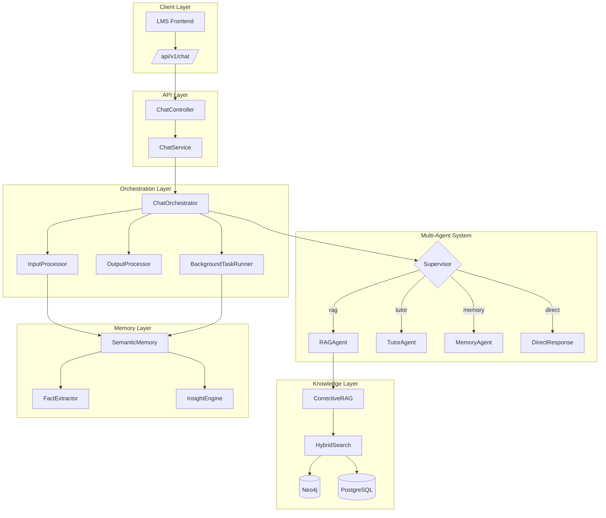
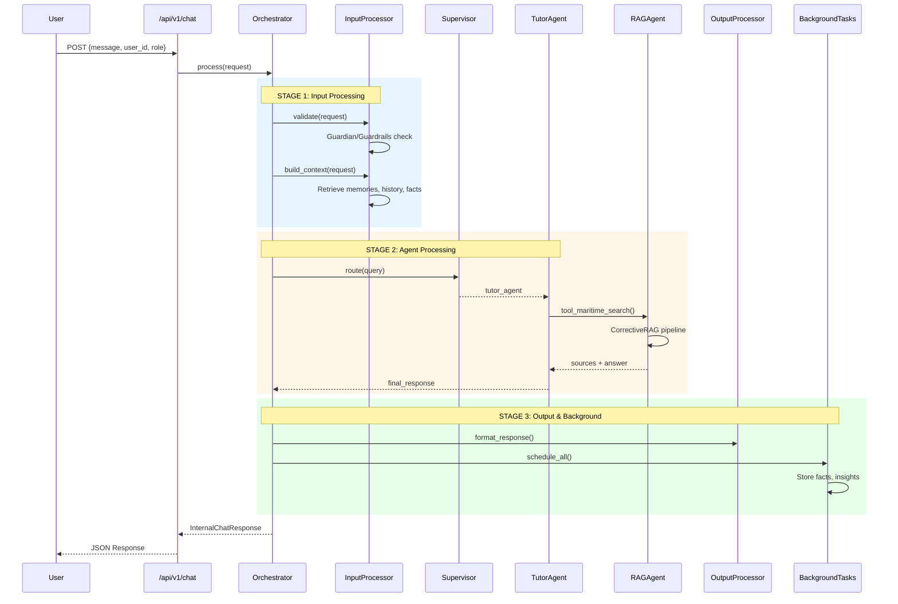
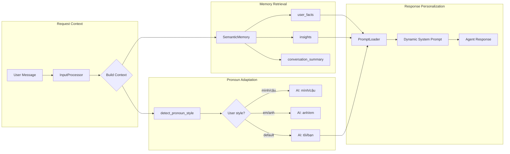
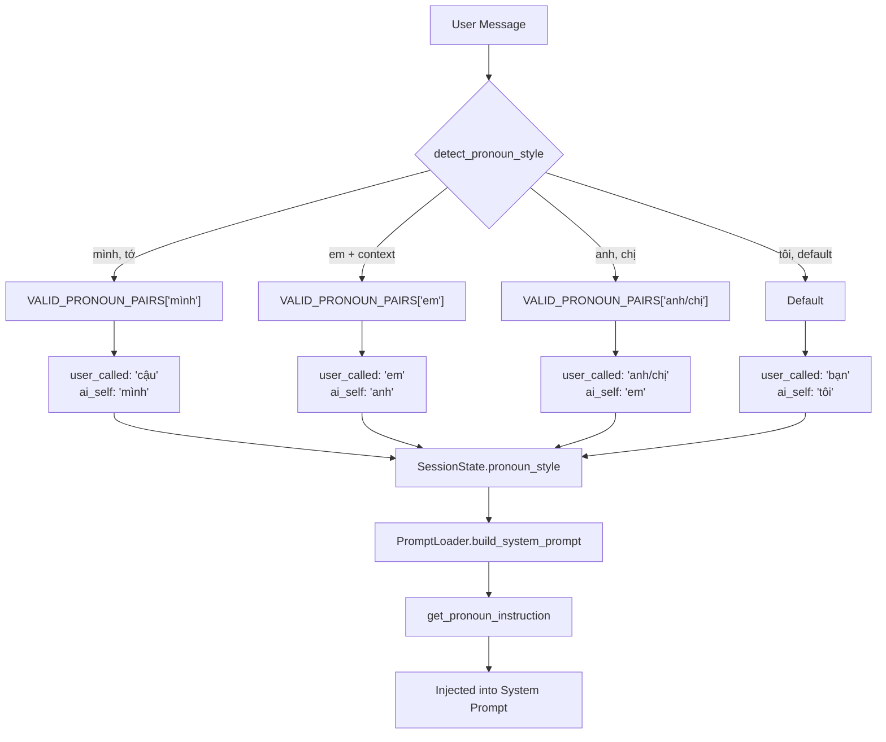
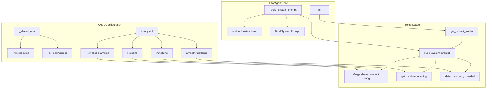

# 🗺️ Maritime AI System Flow Diagram

**Version:** 2.0 (SOTA 2025)  
**Updated:** 2025-12-20  
**Team Board:** Complete system flow for developers

---

## 📊 High-Level Architecture

---

## 🔄 Request Processing Flow

---

## 🧠 Memory & Personalization Flow

---

## 📝 Pronoun Handling (CHỈ THỊ SỐ 20)

### Default Pronouns
- **Mặc định:** AI xưng "tôi", gọi user là "bạn"
- **Thay đổi khi:** User dùng cách xưng hô khác (mình/cậu, em/anh...)
- **Nguồn:** Semantic Memory + Session State

---

## 🎯 YAML Prompt Injection Flow (TO BE IMPLEMENTED)

---

## 📊 Component Status

| Component | Status | Notes |
|-----------|--------|-------|
| ChatOrchestrator | ✅ Active | Main pipeline |
| InputProcessor | ✅ Active | Context building |
| TutorAgentNode | ⚠️ TO FIX | Hardcoded prompt |
| RAGAgent | ⚠️ TO FIX | Inline prompt |
| PromptLoader | ✅ Loaded | Not injected |
| unified_agent | ⚠️ Deprecated | Keep 2 weeks |

---

## 🔗 Key Files Reference

| Layer | File | Purpose |
|-------|------|---------|
| API | `app/api/v1/chat.py` | Endpoint controller |
| Service | `app/services/chat_orchestrator.py` | Main orchestration |
| Service | `app/services/input_processor.py` | Context building |
| Agent | `app/engine/multi_agent/agents/tutor_node.py` | Teaching agent |
| Agent | `app/engine/agentic_rag/rag_agent.py` | RAG pipeline |
| Config | `app/prompts/prompt_loader.py` | YAML loader |
| Config | `app/prompts/agents/tutor.yaml` | Tutor persona |
