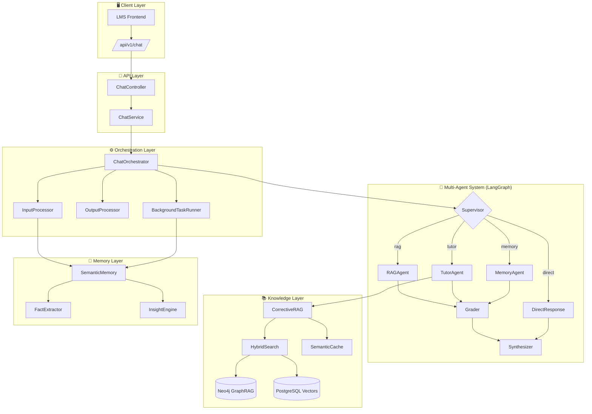
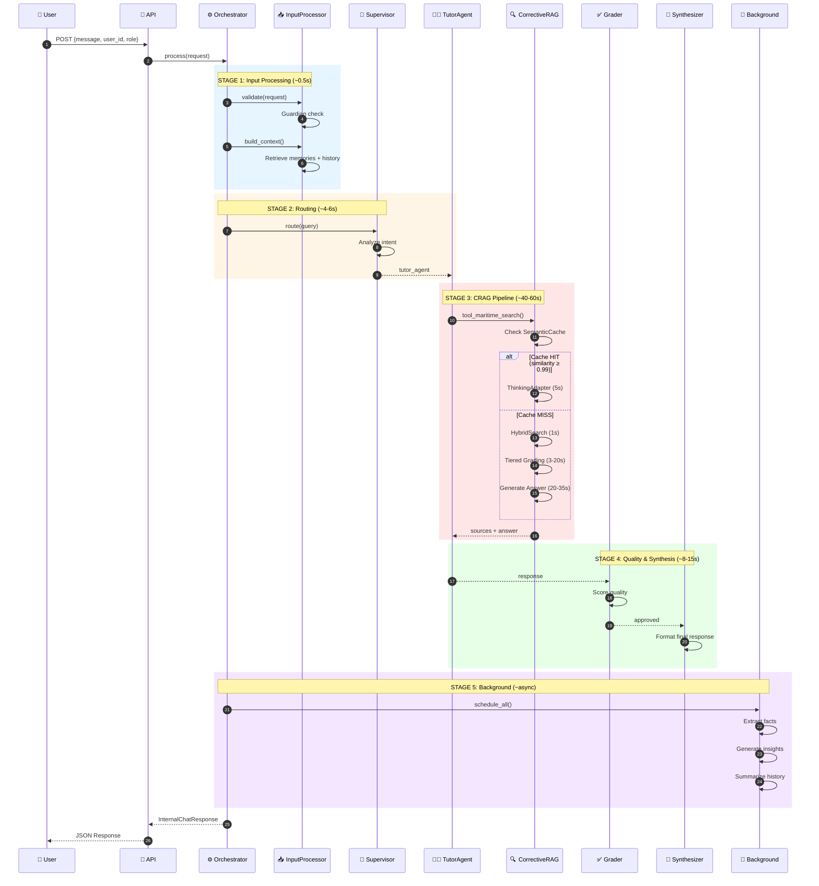
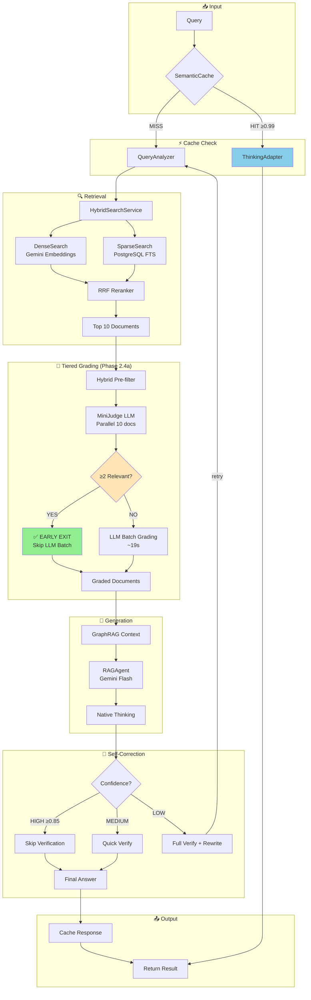
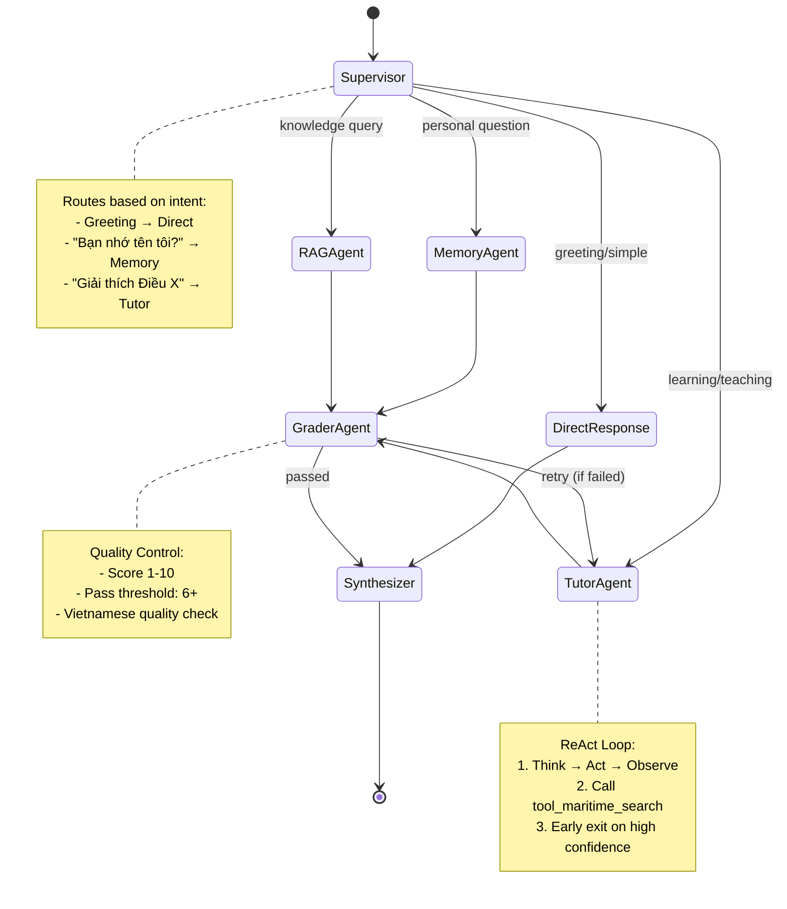
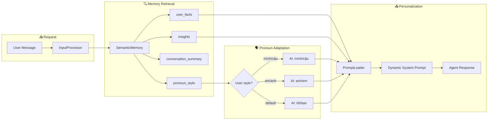
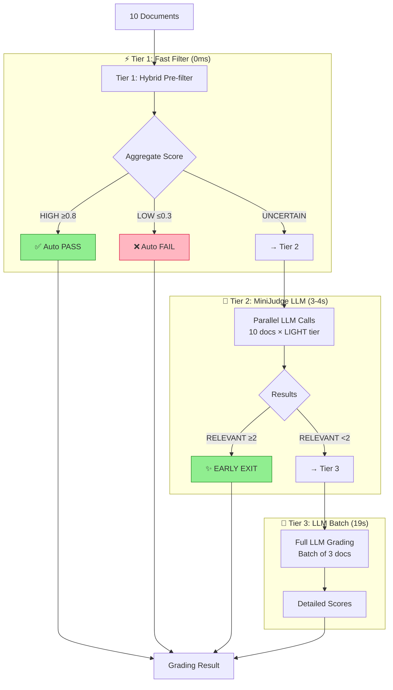

# 🗺️ Maritime AI System Flow Diagram

**Version:** 3.0 (SOTA 2025 - Post Phase 2.4a)  
**Updated:** 2025-12-20  
**Team Board:** Complete system flow for developers

---

## 📊 High-Level Architecture

---

## 🔄 Complete Request Processing Flow

---

## 🎯 Corrective RAG Pipeline (SOTA 2025)

---

## 🏗️ Multi-Agent Graph (LangGraph)

---

## 🧠 Memory & Personalization Flow

---

## ⚡ Tiered Document Grading (Phase 2.4a SOTA)

**Latency Savings:**
| Path | Previous | After 2.4a | Savings |
|------|----------|------------|---------|
| Tier 2 Early Exit | 23s | 3-4s | **~19s** |
| Full Tier 3 | 23s | 23s | 0s |

---

## 📊 Component Status (Dec 2025)

| Component | Status | Latency | Notes |
|-----------|--------|---------|-------|
| ChatOrchestrator | ✅ Active | - | Main pipeline |
| InputProcessor | ✅ Active | ~0.5s | Context + memory |
| Supervisor | ✅ Active | 4-6s | LangGraph routing |
| TutorAgent | ✅ Active | Variable | ReAct + CRAG |
| CorrectiveRAG | ✅ Optimized | 40-60s | Phase 2.4a |
| SemanticCache | ✅ Active | 0.1ms | 2hr TTL |
| Tiered Grading | ✅ SOTA | 3-20s | Early exit |
| ThinkingAdapter | ✅ Active | 5s | Cache adaptation |
| PromptLoader | ✅ Active | - | YAML injection |

---

## 🔗 Key Files Reference

| Layer | File | Purpose |
|-------|------|---------|
| API | `app/api/v1/chat.py` | Endpoint controller |
| Service | `app/services/chat_orchestrator.py` | Main orchestration |
| Service | `app/services/input_processor.py` | Context building |
| Service | `app/services/hybrid_search_service.py` | Dense + Sparse search |
| Agent | `app/engine/multi_agent/graph.py` | LangGraph workflow |
| Agent | `app/engine/multi_agent/agents/tutor_node.py` | Teaching agent |
| RAG | `app/engine/agentic_rag/corrective_rag.py` | CRAG pipeline |
| RAG | `app/engine/agentic_rag/retrieval_grader.py` | Tiered grading |
| RAG | `app/engine/agentic_rag/rag_agent.py` | RAG generation |
| Cache | `app/cache/semantic_cache.py` | Query caching |
| Config | `app/prompts/prompt_loader.py` | YAML loader |
| Config | `app/prompts/agents/tutor.yaml` | Tutor persona |

---

## 📈 Performance Benchmarks (Dec 2025)

| Scenario | Cold Path | Warm Cache | Target |
|----------|-----------|------------|--------|
| RAG Query | 85-90s | 45s | 60-65s |
| Simple Chat | 4-5s | 4-5s | <5s |
| Memory Query | 6-8s | 6-8s | <10s |

**Key Optimizations Applied:**
- ✅ Phase 2.4a: Early Exit saves 19s (60%+ queries)
- ✅ Semantic Cache: 2hr TTL, 0.1ms lookup
- ✅ ThinkingAdapter: 5s for cache hits
- ✅ Parallel MiniJudge: 10 docs in 3-4s
- ✅ Confidence-based iteration: Skip unnecessary loops
