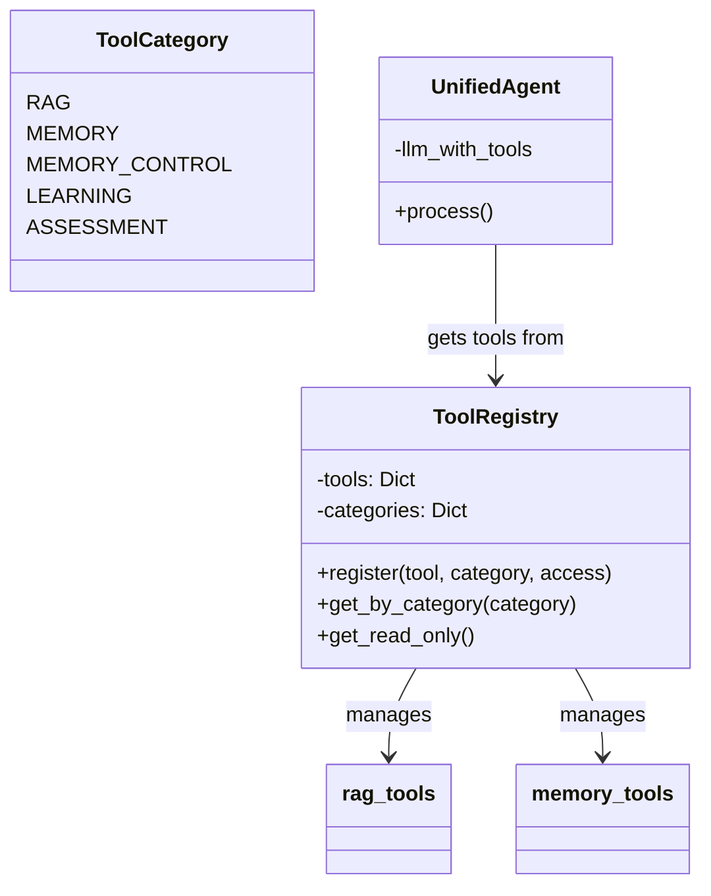

# Tool Registry Pattern Architecture

**Status:** Implemented (v1.0.0)  
**Date:** 2025-12-13  
**Pattern:** SOTA 2025 Tool Management

## Overview

The Tool Registry Pattern is a centralized system for managing AI agent tools. It provides a modular, scalable, and safe way to handle an increasing number of tools (projected 30+) for the Maritime LMS system.

## Architecture



## detailed Components

### 1. ToolRegistry (`engine/tools/registry.py`)
The core singleton class that manages tool registration and retrieval.
- **Categories:** Groups tools logical function (e.g., `RAG`, `MEMORY`).
- **Access Control:** Distinguishes between `READ` (safe) and `WRITE` (mutating) tools.
- **Filtering:** Allows retrieving subsets of tools based on context.

### 2. Tool Modules (`engine/tools/*.py`)
Individual tool implementations extracted from the agent.
- `rag_tools.py`: Knowledge retrieval tools (e.g., `tool_maritime_search`).
- `memory_tools.py`: User profile and memory control tools.

### 3. UnifiedAgent Integration
The agent no longer hardcodes tools. It imports `TOOLS` from the registry package.

```python
# app/engine/unified_agent.py
from app.engine.tools import TOOLS

# Initialize LLM with dynamic tools
llm.bind_tools(TOOLS)
```

## Benefits

1.  **Scalability:** Ready for 30+ LMS tools (Lesson, Quiz, Exam).
2.  **Safety:** Explicit Read/Write separation helps prevent accidental data mutation.
3.  **Maintainability:** Tools are isolated in separate modules, reducing `unified_agent.py` size by 40%.
4.  **Context Awareness:** (Future) Dynamically load tools based on whether the user is "Studying", "Taking Exam", or "Chatting".
